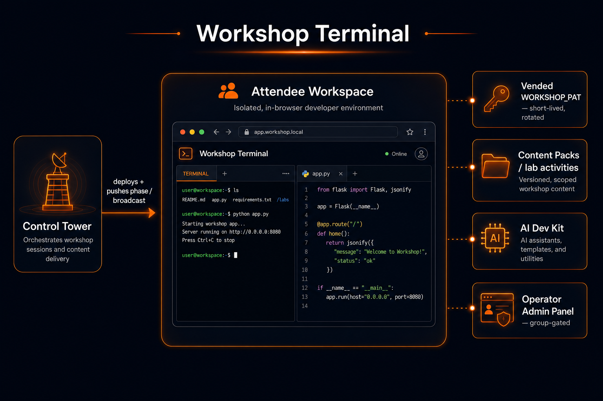

# Databricks Workshop Terminal

A purpose-built, multi-user Databricks App for AI-coding-agent training
events. Attendees open one URL and get **one-click Claude Code / Codex
terminals** with their Databricks credentials wired up automatically — plus a
steerable right-hand pane of curated Databricks insights that operators drive
live during the workshop.

Built to be deployed (and torn down) as workshop infrastructure by
[databricks-labs-control-tower](https://github.com/althrussell/databricks-labs-control-tower).

## Architecture

Control Tower deploys the Workshop Terminal into each attendee's isolated
workspace and pushes phase/broadcast updates live. The app vends a short-lived,
rotating `WORKSHOP_PAT`, serves config-driven content packs and an AI Dev Kit,
and exposes a group-gated operator admin panel.



## What attendees get

- **Launch buttons** for Claude Code, Codex, and a plain terminal — the agent
  catalog is config-driven (`content/agents.json`), extensible per event.
- **Zero-touch auth**: Control Tower vends a workspace credential at deploy
  time (`WORKSHOP_PAT`); the app chains short-lived rotating tokens off it
  and feeds them to every CLI config. Attendees never see a token screen.
- **Session isolation**: per-user HOME directories, sessions strictly bound to
  their owner, secrets stripped from terminal env (deny-by-default). Note this is
  HOME/PTY-level isolation, not credential isolation — the vended credential and
  git identity are shared instance-wide. The supported topology is **one
  disposable workspace (and instance) per attendee**; running multiple attendees
  on one instance is unsupported unless you set `ALLOW_SHARED_TOPOLOGY=true` to
  acknowledge the shared-credential caveat. The instance warns at startup and when
  a second attendee appears.
- **Resilient terminals**: PTYs survive page refreshes and wifi blips —
  reconnect and your scrollback replays.
- **Insight nuggets**: a collapsible pane of docs, best practices, and
  marketing-grade product cards that follows the workshop phase, reacts to
  activity signals, and **watches the terminal for topics** — mention
  Lakebase and a "spotted in your session" Lakebase card appears with the
  value prop and docs link. Only topic flags are recorded, never terminal
  content (`TOPIC_DETECTION=false` to disable).
- **A coached first run**: launching Claude greets the attendee
  ("agent speaks first"), a lab-coach persona adapts to technical vs business
  attendees, the latest [ai-dev-kit](https://github.com/databricks-solutions/ai-dev-kit)
  skills are fetched at every boot, TDD subagents are pre-installed, and every
  git commit auto-syncs to the attendee's Workspace home so their work
  survives teardown.

## What operators get

- An in-app **Operator panel** (members of the `platform_admins` workspace
  group): live presence, phase control, broadcast banners.
- A remote **admin API** (same group, works for service principals too) for
  Control Tower or `scripts/push_content.py` — push content packs, set the
  phase, broadcast. See [docs/admin-api.md](docs/admin-api.md).
- **Cobranding** via env vars (`BRAND_NAME`, `BRAND_LOGO_URL`,
  `BRAND_PRIMARY_COLOR`, `EVENT_NAME`) for single-customer enablements.

## Architecture

- **Backend**: FastAPI + stdlib `pty`, single uvicorn worker (PTY fds and
  session state are process-local by design). WebSockets for terminal I/O
  (`/ws/sessions/{id}`) and app events (`/ws/events`).
- **Frontend**: React + TypeScript + Vite + xterm.js. The production build is
  **committed to `static/`** because Control Tower deploys the repo
  as-cloned with no build step.
- **No external state**: no Lakebase, no database. Content/phase live in
  memory and reset to the deployed pack on restart; teardown is a plain
  `apps.delete`.
- **Security**: workspace-group based. Identity from the Apps proxy headers;
  operator access requires `ADMIN_GROUP` (default `platform_admins`)
  membership resolved via SCIM — using the caller's bearer token for service
  principals, or the vended credential to look attendees up by email.
  Optional `ACCESS_GROUP` restricts attendees.
- **Agent egress & autonomy** (P1-21): the agent runs autonomously
  (`WORKSHOP_AUTO_MODE`, no approval prompts) with a live workspace credential.
  This is acceptable **only** under the one-workspace-per-attendee topology
  (see the isolation note above), where the blast radius is a single disposable
  workspace. To limit the indirect prompt-injection surface, **public MCP
  servers (DeepWiki, Exa) are off by default** — opt in per event with
  `ENABLE_PUBLIC_MCP=true` — and the ai-dev-kit skills overlay is **pinnable**
  via `AI_DEV_KIT_REF` (default `main`; pin a tag/SHA for an event so attendees
  run a known, reviewed skills version rather than the branch tip at boot).

## Deploying

### Prerequisite: vended credential

The deployer (Control Tower) must inject a workspace credential as the
`WORKSHOP_PAT` env var (or secret). Databricks Apps OBO scopes exclude the
Token API, so the app can't mint credentials itself — see
[docs/admin-api.md](docs/admin-api.md) for the vending contract. Without it
the app serves plain terminals and shows a clear banner, but agent CLIs
can't authenticate.

### Via Control Tower

Add a `WorkshopApp` row pointing at this repo (`git_url`, branch `main`).
Configure per-event behaviour through `env_overrides` — every variable in
[docs/admin-api.md](docs/admin-api.md#deploy-time-configuration-env-vars) is
read at runtime.

### Dev smoke test

```bash
pip install databricks-sdk
export DATABRICKS_CONFIG_PROFILE=my-dev-workspace
python scripts/deploy_dev.py
```

Then: launch Claude → run `databricks current-user me` in the terminal →
confirm it's *you*; open a second browser profile as another user and confirm
they can't see your tabs.

## Local development

```bash
make install        # venv + pip + npm
make dev-backend    # uvicorn on :8000 with fake identity (dev@example.com, platform_admins)
make dev-frontend   # Vite on :5173, proxies /api and /ws
make test           # pytest: isolation, authz, caps, triggers, replay
```

Before committing UI changes: `make build-frontend` and commit `static/`.

## Repo map

```
app.yaml                  Databricks Apps entrypoint (single worker!)
server/                   FastAPI backend
  auth.py                 identity + group authz (SCIM /Me, cached)
  users.py                per-user HOME/env isolation
  credentials.py          vended-credential bootstrap + 10-min rotation
  cli_config.py           claude/codex/databricks CLI config writers
  sessions.py             PTY lifecycle, ownership, scrollback, reaper
  ws.py                   terminal + events websockets
  content.py              nugget packs, phases, triggers, broadcasts
  admin.py                operator/steering API
  bootstrap/              boot-time CLI installers (pinned, idempotent)
frontend/                 React + TS source (Vite)
static/                   committed production build — do not hand-edit
content/                  default nugget pack + agent catalog
scripts/                  push_content.py (steering), deploy_dev.py
docs/admin-api.md         Control Tower integration contract
```
