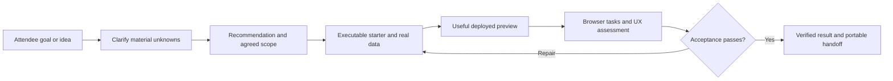

# Workshop Terminal: generated-app quality audit and remediation plan

Status on 9 October: **R01 is complete with a failed current-release baseline**.
The branch uses latest `main`, `440232b953a5050c965838b42a594e1592ee3d33`, also
the CT-pinned WT `v2026.09.28.1` PEX revision. One eligible Claude/AppKit run
created a real bakery app from simple nontechnical inputs. Independent observation
proved missing scope agreement, an Invalid Date display, and offscreen mobile
status/action columns. Adding/packing worked through UI and survived reload/fresh
context; independent Lakebase storage proof and full acceptance remain unverified.
The [R01 closeout](evidence/generated-app-r01/live-20261009-68bd/CLOSEOUT.md) records
receipts, inspected screenshots, limitations, and independently verified cleanup.
CT code and its working deployment are unchanged. R02 is implemented in the
working tree; R03–R10 remain proposed. The [R02 implementation report](workshop-interaction-contract-r02.md)
records policy delivery, local regressions, model probes, and their limits. No
release deployment or generated-app UX acceptance is implied.

Audited on 8 October 2026 against commit `4d46461c6a0229892bdda5c153d8a6dd03d316c6`.
Scope: attendee onboarding, prompts, coaching, skill installation, project setup,
Claude/Codex/Omnigent instruction delivery, AppKit/APX guidance, UI patterns,
deployment acceptance, telemetry, CI, and workshop rehearsal.

CT's local Labs deployment bundle pins WT `v2026.09.28.1`. The working branch and
verified package now agree with that release. The [CT provisioning comparison](control-tower-test-parity.md) records
the source versions, actual attendee/app-SP/model setup, simulation gaps, and
corrected R01 execution order. The original finding line numbers refer to August.
Before R02, the latest-source comparison confirmed the build-immediately and
no-browser policies, wizard UI, brief storage, and design-studio instructions.
R02 replaces the conflicting interaction/readiness prose; the broader wizard
flow and storage fixes remain R03 work.
September added governed model selection and a resumable deployment MCP tool;
the August model-access/deploy-loop observations must not be attributed to this
release. Pi is absent from the current offered toolchain. Broader historical
findings need the same explicit version comparison before remediation.

## Recommendation

### Workshop pacing and scope

The workshop gives attendees a quick, compelling taste of what they can build.
The target is a polished working demo within the session. This guidance governs
R02 implementation. Keep the detailed
audit and operator qualification checks separate from the attendee conversation.

- Start from the attendee's goal. If it is clear enough, recommend a small demo
  and build. Otherwise ask one or two consequential questions together in one
  short exchange; aim to spend about a minute shaping the idea. Reuse wizard
  answers and never treat a list of possible requirements as a questionnaire.
- Give one practical recommendation with a short reason. State the first version
  and sensible demo assumptions in a sentence or two, then proceed. Request a
  separate confirmation only when a consequential choice is unresolved; do not
  make every attendee approve a formal scope or proposal.
- Choose the framework, components, sample data and straightforward storage
  defaults for the attendee. Label sample data clearly. Defer production
  architecture, enterprise authentication, integrations, exhaustive edge cases
  and extra features unless they are essential to the requested demonstration.
- Get the main workflow on screen early. Check that it works, dates and labels
  make sense, controls are visible at the relevant size, and claimed remembered
  changes survive reload. Fix obvious issues with a bounded repair effort.
- Adapt explanation to the attendee's experience. Prefer a compact walkthrough
  and an invitation to try or change the demo over more analysis. Mention material
  demo limitations briefly; do not turn the handoff into a production checklist.

The workshop quality floor remains real: readable and attractive presentation,
working primary actions, truthful data/state claims, and appropriate platform
permissions. Broader accessibility, fault, restart, visual calibration and fleet
checks belong in reusable starters, CI and operator rehearsal. They must not
become a lengthy planning or approval ceremony for each attendee.

Fix the workshop's product and quality contract first, and judge the result by
real app builds. The two observed problems have direct causes in this repository:
the agent is repeatedly told to avoid requirements validation, and it is forbidden
to run the browser checks that would expose poor UX. These are deliberate policies,
not merely omissions or an agent occasionally ignoring a good prompt.

AppKit is the current default. Its strategic connection to the upcoming Genie app
builder is the workshop's stated rationale, not a compatibility guarantee verified
by this audit. Retain AppKit during remediation, build a much stronger executable
starter, and compare it with a refreshed, pinned APX path using the same novice
scenario. Ship the default that passes the functional and UX gates. If AppKit
cannot meet that bar within the agreed implementation timebox, use APX for the
next event and treat Genie familiarity as a secondary goal.

The desired experience is: the attendee describes a problem; the agent helps
shape the product with a few useful questions and recommendations; the attendee
gets a polished, working app; the agent demonstrates that its central task works.
The attendee should not need to name a framework, database, component, or testing
tool to receive this experience.

The decisive test and simulator contract are in
[generated-app-e2e-acceptance.md](generated-app-e2e-acceptance.md). A machine-readable
proposed scenario is in
[novice-bakery-app.json](examples/novice-bakery-app.json).
The implementation status and simulation-first operating steps are in
[generated-app-evaluation-runbook.md](generated-app-evaluation-runbook.md).

The extended [onboarding-wizard audit](onboarding-wizard-audit.md) adds 40 detailed
findings and reproducible synthetic evidence. The wizard needs an optional
goal-first journey, stable request/selection state, preserved generated tasks,
useful recommendations, and recoverable launch. Keep it disabled for events until
the full wizard-to-generated-app gates pass; qualify the disabled entry path too.

## Evidence and limits

The later R01 [isolated Labs evidence](evidence/generated-app-r01/live-20261008-b53c/summary.json)
records genuine labuser authentication, all 419 runtime file hashes, and 20 real
synthetic orders. The plain bakery sentence could not advance without an industry;
selecting Retail preserved WT's build-now/one-question starter but encountered
native startup and model authorization blockers. The original attempts proved
Sonnet 5 exists while the test app SP lacked effective model EXECUTE access,
despite `/readyz` reporting ready. The
[later dated follow-up](evidence/generated-app-r01/live-20261008-b53c/README.md)
preserves five independently verified direct EXECUTE grants after further user
authorization. CT code, deployment, groups, and existing principals' permissions
were unchanged. The run window expired before an app-SP wire canary or generated
app was completed. The simulator must qualify an actual app-SP invocation before
treating a cell as a model-quality benchmark. No generated-app UX score or app
acceptance follows from this evidence. Recorded external evaluation
deployment/fixture/journey/result regression groups passed 289 tests; the later
focused independent-result suite passed 47 tests.

Three parallel audits covered runtime/harness delivery, design/framework guidance,
and onboarding/tests. Source findings below refer to the audited commit. Existing
tests were executed locally:

- 221 tests passed across `test_design_guarantee`, `test_project_setup_guarantee`,
  `test_user_content`, `test_wizard`, `test_wizard_llm`, `test_omnigent_config`, and
  `test_skills_provenance`.
- All 94 frontend tests passed with `node --import tsx --test src/*.test.ts`.
  The normal `npm test` command hit the sandbox's restriction on the `tsx` IPC
  socket; direct Node execution exercised the same test files successfully.
- An offline scaffold shim emitting a progress line reproduced the documented
  project-helper command-substitution failure. No real cloud scaffold was invoked
  for that reproduction.
- APX source was reviewed at commit
  [`a88ee32f22669eac0df57198006bdba7db44a878`](https://github.com/databricks-solutions/apx/tree/a88ee32f22669eac0df57198006bdba7db44a878).
- Extended wizard verification reproduced the compulsory industry gate, focus
  escape, and stale recommendations in the actual rendered component with a
  synthetic API. Offline contract execution reproduced ten save/handoff/discovery
  defects. The additional test groups passed but overlap earlier groups; see the
  dedicated audit for counts, scope, and retained evidence.

No real attendee-generated app, deployed screenshot, browser trace, or recording
from the 60-person event was available in the repository. No live cloud app build
was run for this audit. The pattern files were inspected but not independently
compiled or rendered here. Source establishes incomplete handlers and contradictory
policies; it does not establish which fragment a particular attendee's agent used,
or prove that AppKit itself is responsible for the observed appearance.
The event's wizard revision/configuration and recommendation traces are also
unknown. Local wizard reproductions establish failure mechanisms in the audited
code, not their incidence or relative importance at that event.

R01 now includes an external novice simulator, authenticated browser and harness
adapters, bounded journey orchestration, failure-preserving reports, a native
MLflow evaluation adapter, and direct Labs deployment with simulated CT inputs.
The optional runtime transcript observer is default-off and admin-only. Its
instrumented runtime snapshot is identified separately from the audited release;
unchanged prompt policy is an explicit assertion, not an exact-package claim.
Local adapter tests and a rendered HTTP/WebSocket smoke do not establish a live
novice-to-generated-app pass. Native pinned-CLI qualification, independent deployed
task/persistence/UX evidence, and complete executable runner wiring are still needed.

Testing proceeds on an isolated WT instance deployed directly into Labs with
fresh resources and simulated CT environment/bindings. The current instance is
bound to the genuinely authenticated labuser as a synthetic attendee; actual
CT assignment, model-caller provisioning, and event workspace isolation remain
separate qualifications. The earlier operator-bound receipt is preserved. Actual CT
provisioning/integration follows only after WT passes the isolated E2E gates.
Control Tower code and its working Labs deployment remain outside this remediation.

Priority definitions: P0 changes are needed to change the failed experience;
P1 changes are needed for dependable all-harness delivery and acceptance; P2
changes improve compatibility, observability, and portability. These are product
priorities, not security severity ratings.

## Findings inventory

### Requirements, recommendations, and onboarding

| ID | Priority | Evidence | Issue and impact | Workstream |
|---|---|---|---|---|
| F01 | P0 | `assets/instructions/CLAUDE.md:29-31,182-199`; `assets/instructions/lab_coach.md:21-34,61-77`; `assets/instructions/project_memory.md:93-96` | Base, coach, and project instructions tell the agent to build immediately, avoid requirements rounds, and correct misunderstandings mid-build. Advice is nominally encouraged, but the opportunity to give it is largely removed. | R02 |
| F02 | P0 | `server/wizard.py:533-565`; `tests/test_wizard.py:416-429` | The starter manufactures a build-now instruction that the attendee did not author. Card choice can replace the typed ambition entirely. Entry paths do not share one consultation contract. | R02, R03 |
| F03 | P0 | `server/user_content.py:277-339,390-399` | The late wizard overlay forbids restating requirements or clarifying. A change to the coach alone would still be contradicted by this overlay. | R02 |
| F04 | P1 | `server/wizard.py:82-105,128-136`; `frontend/src/components/Wizard.tsx:449-452,619-637,724-742` | The brief is onboarding/discovery context: goal sentence, industry, intent, persona, and stack. It lacks users, workflow, acceptance criteria, persistence expectations, consequential assumptions, and agreement. Even industry alone counts as content. "One sentence is plenty" works only if subsequent consultation fills these gaps. | R03 |
| F05 | P1 | `server/wizard_llm.py:182-185`; `frontend/src/components/Wizard.tsx:345-362`; `server/wizard.py:377-383,475-500,542-545` | Dynamic cards are not in the static catalog consulted on save. Their generated prompt/table metadata is omitted from the save payload and lost; a failed ID lookup also bypasses the industry-save branch. The next agent can receive a different, less grounded task than the attendee selected. | R03 |
| F06 | P1 | `assets/skills/databricks-apps/SKILL.md:68-98,191-197`; `assets/instructions/lab_coach.md:53-55` | Technical decision gates ask for Lakebase versus Analytics, resource choices, and fully qualified tables, while business coaching suppresses component names. Product requirements remain unvalidated. Advice must be framed as user outcomes, with identifiers discovered through tools. | R02, R03 |
| F07 | P1 | `assets/instructions/CLAUDE.md:211-213,301-303`; `assets/skills/databricks-app-design/SKILL.md:26-28,49-62`; `assets/skills/workshop-design-studio/SKILL.md:103-110` | All dashboards are described as AppKit builds while plain dashboard requests are routed to managed AI/BI. Data design asks for explicit tradeoffs/proposals while the studio says to present none. Missing precedence causes inconsistent consultation and output choice. | R02 |

### Design and executable defaults

| ID | Priority | Evidence | Issue and impact | Workstream |
|---|---|---|---|---|
| F08 | P0 | `assets/skills/workshop-design-studio/SKILL.md:64-93`; `assets/instructions/CLAUDE.md:288-293,305-340`; `assets/instructions/project_memory.md:103-120`; `assets/instructions/lab_coach.md:84-90` | A deployed URL is the main gate. Browser runs, smoke-test updates, validation, and design artifacts are expressly discouraged or prohibited. The only visual review is a cheap mental pass after deployment. No observed journey or UX evidence is required before claiming readiness. | R02, R06 |
| F09 | P1 | `assets/skills/workshop-design-studio/SKILL.md:20-23,95-110,141-159` | The studio conflates avoiding palette questionnaires with privately guessing the audience and primary task. It also supports only AppKit, so the optional APX path has no applicable common visual contract. | R02, R05, R07 |
| F10 | P1 | `assets/skills/workshop-design-studio/references/patterns/app-shell.tsx:24-25,40-43,65-66,85` | Navigation changes only a highlighted local flag; content does not route. The primary button has no action. These are incomplete fragments described as copy-ready defaults. | R05 |
| F11 | P1 | `assets/skills/workshop-design-studio/references/patterns/form.tsx:38,63-68,113,128-130`; `hero-first-run.tsx:18,44,48-50`; `states.tsx:154` in the same directory | Optional submit/action callbacks permit inert UI; form rejection lacks visible error recovery; Cancel/example actions are unwired; the sample remote success branch is blank. Depot validation is not associated with its control. | R05 |
| F12 | P1 | `assets/skills/workshop-design-studio/references/patterns/kpi-row.tsx:37-42`; `chart-card.tsx:32,52`; `states.tsx:114-122` in the same directory | Hardcoded KPI values, chart interpretations, provenance text, and a universal "database timed out/data safe" error teach plausible-looking but potentially false UI. The KPI pattern lacks required period/source/freshness fields. | R05 |
| F13 | P1 | `assets/skills/workshop-design-studio/references/patterns/app-shell.tsx:30-68`; `hero-first-run.tsx:43` in the same directory | Fixed horizontal chrome/action rows have no narrow-screen transformation. This is a responsive-layout risk requiring browser proof, despite the written narrow-window promise. | R05, R06 |
| F14 | P1 | `assets/skills/databricks-apps/references/appkit/appkit-sdk.md:89-93`; `references/appkit/frontend.md:47,151-158,174` | Minimal examples render a raw error/null, use generic cramped layout, or raw colors/platform branding. These undermine the stronger token, truthful-state, and brand-neutral instructions. | R05 |
| F15 | P2 | `assets/skills/workshop-design-studio/references/patterns/README.md:31-44`; `assets/skills/databricks-apps/SKILL.md:45`; `tests/test_design_guarantee.py:331-348` | Patterns claim verification against UI 0.50.0, while scaffolding controls the installed version. Tests check import strings rather than actual exports/props, compilation, or rendering. Compatibility is not continuously established. | R05 |
| F16 | P2 | `assets/skills/databricks-app-apx/SKILL.md:28-43,101,113-117,144-151,165` | APX instructions use an older installer, external shadcn MCP, stale tool names, `jq` despite its absence, and a bundles skill name inconsistent with this kit. An APX switch would currently introduce its own setup risks. | R07 |
| F17 | P2 | `assets/skills/promote/build-prompt.md:39-57` | Take-home guidance prescribes AppKit and workshop-only helpers even when the actual project uses another stack. It does not reliably carry the approved product brief or validation gaps into the next harness. | R08 |

These are defects or risks in the defaults, not evidence that every generated app
copies them unchanged. A more elaborate prose baseline cannot substitute for a
starter whose visible controls and states are exercised.

### Instruction delivery and project continuity

| ID | Priority | Evidence | Issue and impact | Workstream |
|---|---|---|---|---|
| F18 | P1 | `server/bootstrap/install.py:812-821,1702-1706,1753-1767` | Prewarmed skills reuse verifies only upstream skill names/digests and returns before refreshing workshop-owned assets. A design-studio update can be absent from a supposedly current persistent install. | R04 |
| F19 | P1 | `server/obo.py:289-290`; `server/omnigent_remote.py:323-352,565-590`; `server/users.py:103-119`; `server/main.py:804` | OBO can launch a remote host before local session creation, the sole production content-provisioning call. Opening the paired Omnigent UI first has no guaranteed coach/design skills/helper preparation. | R04 |
| F20 | P1 | `server/user_content.py:53-74` | Required-step failures are logged but the user is still marked provisioned, preventing subsequent retries in the process. A session can stay permanently missing mandatory content. | R04 |
| F21 | P1 | `server/bootstrap/install.py:364-389,2016-2045`; `server/main.py:758-768`; `server/user_content.py:537-548` | Launchability measures CLI binaries rather than the full build environment. Parallel installation can race platform tooling/skills, and a fallback skill linkage need not be reconciled after installation. | R04 |
| F22 | P1 | `server/user_content.py:416-455,527-530`; `assets/instructions/project_memory.md:6-9`; `server/bootstrap/install.py:48-56` | Home policy is duplicated into Claude/Codex, but isolated workers depend on committed project memory. Current project memory does not carry the attendee's evolving brief/decisions. Pi and upstream worker skill copying are not proven here; comments are not functional parity evidence. | R03, R04, R08 |
| F23 | P2 | `assets/bin/workshop-init-project:96-101,177`; `assets/instructions/CLAUDE.md:131-137`; `tests/test_user_content.py:348-410` | The documented `cd "$(workshop-init-project ... --appkit)"` captures scaffold progress/errors plus the path. A noisy offline shim reproduces the failure. Existing tests use silent success or accept a path suffix. | R04 |
| F24 | P1 | `assets/bin/workshop-init-project:104-109,125-145,174` | Existing AGENTS.md is not updated; an old marked CLAUDE.md is not migrated. Scaffold failure returns a plain project and commit failure is swallowed, even though worktree inheritance needs committed memory. | R04, R08 |
| F25 | P1 | `scripts/refresh_vendored_skills.py:37-47,114-119`; `assets/skills/SKILLS_SOURCE.md:34-49` | Refresh deliberately removes planning/verification skills and replaces upstream directories verbatim. Fixes made only in upstream-owned vendored prose can disappear. Home/project/coach/studio duplication also dilutes precedence. | R02, R04 |

### Acceptance, measurement, and testing

| ID | Priority | Evidence | Issue and impact | Workstream |
|---|---|---|---|---|
| F26 | P0 | `tests/test_design_guarantee.py:1-21,87-96,296-309`; `tests/test_user_content.py:113-150` | Tests acknowledge runtime quality is unchecked and actively pin deletion of gates plus post-deploy mental critique. They protect the behavior the attendee report asks us to change. | R01, R02, R06 |
| F27 | P1 | `tests/test_design_guarantee.py:315-392`; `frontend/package.json:7-10`; `.github/workflows/ci.yml:34-35,55-60`; `tests/conftest.py:83-98` | Pattern text checks, pure-function frontend tests, builds, and shell-substituted agent tests cannot assess rendered onboarding, agent consultation, or generated-app usability. | R01, R05, R06 |
| F28 | P1 | `scripts/regress_mode2.py:140-173`; `scripts/ct_two_instance.py:1528-1558`; `scripts/probe_omnigent_app_build.py:2-11,71-88`; `docs/verification-gate.md` | Live probes prove model/PTY or infrastructure setup. The build probe intentionally tolerates startup failure for dependency-installation proof. None is a novice-to-deployed-app acceptance test. | R01, R09 |
| F29 | P2 | `server/stats.py:189-221`; `server/telemetry.py:26-57,84-145`; `server/insight_summary.py:418-420,473-516` | Any commit can mean "shipped", including the initial scaffold commit. Quality stages, recommendations, requirements agreement, deployed task completion, and visual evidence are not tracked. Downstream summaries can overstate success. | R09 |
| F30 | P1 | `docs/omnigent-modes.md:11-17,96-120`; `server/bootstrap/install.py:48-56`; `deploy/omnigent-app/smart_routing.py:157-160,271-279`; `server/main.py:280-309`; `docs/model-comparison.md:52-56,110-125` | Routes/models have different capabilities: bare Codex is Responses-only, while offered Pi/Auto routes support other wires and already filter incompatible choices. Their app-building quality remains unmeasured. Managed modes are not workshop-supported; model-comparison documentation is stale against current routing code. An all-agents claim needs an exact supported path/model matrix and measured results, including Auto's actual selection. | R01, R07, R09, R10 |

### Extended onboarding findings

These entries summarize the detailed W01–W40 inventory in
[onboarding-wizard-audit.md](onboarding-wizard-audit.md).

| ID | Priority | Evidence | Issue and impact | Workstream |
|---|---|---|---|---|
| F31 | P1 | W01–W05, W19 | Mandatory industry, absent task-fit/consultation contract, ignored optional recommendation context, hidden capture explanation, and inaccurate readiness copy impair the novice journey. | R02, R03 |
| F32 | P1 | W06–W13 | Debounce, GET/POST, Surprise, and mutable-grid selection race; explicit clearing and static-only matching fail their intended contracts. Older input can determine visible ideas or overwrite selection. | R03 |
| F33 | P0 | W30–W34 | Dynamic task loss compounds F05; generated/static ID collision can launch a different product. Mutable pack lookup and concurrent saves violate stable task/record identity. | R03, R08 |
| F34 | P1 | W20–W29 | Forced shape variety displaces relevance; table-only checks overpromise feasibility; malformed output escapes fallback; serving lacks invocation failover/overall deadlines; fallback/order/counts and cold loads are unreliable. | R03, R09, R10 |
| F35 | P1 | W14–W18 | Save/launch/load failures do not provide truthful recoverable states; draft and selection can disappear. Modal labeling/focus and custom-sector interaction need rendered verification. | R03, R06 |
| F36 | P1 | W35–W39 | Independent wizard/discovery writers destructively replace context; clearing, capture/persona changes, disabled-state semantics, and isolated-worker propagation need explicit contracts. | R03, R04, R08, R09 |
| F37 | P1 | W40 | Passing static/dynamic/text tests miss the same-card round trip, rendered races, actual model wire, and real novice selection-to-app outcome. | R01, R03, R06, R09 |

## Strengths to preserve

Keep the one-workspace-per-attendee topology, credential rotation and recovery,
identity separation, resource-grant reconciliation, PTY reconnect behavior,
verified toolchain/skill provenance, typed SQL generation, manifest-first resource
discovery, current API-doc checks, semantic color guidance, KPI polarity, brand
neutrality, and Genie identity/SQL transparency. The existing operational tests
remain required; app quality adds another acceptance layer.

Keep onboarding short and skippable. Keep aesthetic decisions with the agent.
Do not restore a lengthy universal PRD or ask business attendees to choose
libraries. A compact product consultation is sufficient for simple workshop apps.

Commercial/account discovery and product requirements serve different purposes.
Requirements shaping must work when `LAB_COACH`, `DISCOVERY_ENABLED`, and insight
capture are off. Do not send newly captured product requirements to Control Tower
without the existing consent/configuration rules and a reviewed contract change.

## Target workflow

1. **Understand quickly.** Reuse wizard facts. Ask only what would materially
   change the demo's central task. Usually zero questions for a clear request,
   or one or two together for an ambiguous request. Use sensible defaults for
   ordinary implementation choices; aim for one brief exchange, about a minute.
2. **Recommend and frame.** Recommend a small first version and explain its user
   benefit in one or two sentences. State consequential demo assumptions. The
   attendee's request or answer can establish scope; a separate approval turn
   is needed only for an unresolved consequential choice.
3. **Choose internally.** Decide app versus managed dashboard and the storage/data
   path from the agreed outcome. Discover resource IDs through tools. Explain
   user-visible tradeoffs plainly; offer architecture detail when requested.
4. **Build with working defaults.** Select an operational queue, analytics, or AI
   starter; bind real data; implement all visible actions, routes, and states.
5. **Show a useful preview.** Share it early with a truthful status. A blank shell,
   unbound sample page, dead navigation, or broken primary workflow is not a useful
   preview. A preview URL is not the completion criterion.
6. **Observe and repair briefly.** Verify the primary journey, dates/labels,
   persistence where claimed, and desktop/narrow presentation. Fix visible
   blockers promptly. Reusable starter and operator tests provide deeper state,
   fault and accessibility coverage outside the attendee's build conversation.
7. **Demonstrate and hand off.** Say what was checked, provide the URL and a short
   product walkthrough, and disclose any remaining material limitation. Preserve
   the brief, source, actual framework, and validation evidence for another agent.

For example, first ask: "What makes an order need attention?" After the bakery
answer, say: "I'll make a simple list with late, unpacked orders first and a button
to mark them packed. I'll use clearly labelled demo orders and remember updates,
so you can try the whole workflow." Then build. Ask about data only when the
attendee has requested a real source or the choice would materially change the
demo. This offers advice and a visible direction without a formal approval turn.

## Architecture and implementation decisions

### Help preferences for different experience levels

WT serves business users, data practitioners and software developers. The bakery
scenario is a deliberately nontechnical test of the minimum experience, not WT's
only audience. Current `server/user_content.py` seeds a binary business/technical
persona with a business default; the wizard exposes an optional choice. That
controls vocabulary but cannot express coding familiarity, Databricks familiarity,
or a preference for concise versus guided collaboration.

In R02, define one requirements and UX contract for everyone. Adapt explanation,
recommendation detail and pacing to the request and an optional help preference:
"Guide me", "Keep it concise", or "Discuss technical choices". An experienced
user's complete request can go straight to implementation once material choices
are known. No preference bypasses persistence, permissions, usability or observed
completion checks. Avoid inferring expertise from job title or the absence of a
toggle; observed familiarity may suggest a preference but is not a confirmed fact.

In R03, expose the preference in optional onboarding context and a changeable
session/settings control, including when the wizard is disabled. If useful, allow
separate optional coding and Databricks familiarity settings; never make these a
mandatory questionnaire. Store explicit choice and provenance in a versioned
profile, migrate the old persona conservatively, and refresh all harness adapters
without discarding the product brief or changing the current build. Propagate the
minimum relevant preference across workers, reconnect and agent switching under
the existing privacy rules. R08 verifies that continuity.

Evaluate the same business goal with a nontechnical user, a developer new to
Databricks, a Databricks practitioner new to UI development, and an experienced
app developer. Record consultation usefulness and unnecessary questions by cell,
while applying the same functional and UX acceptance floor. R01 preserves its
original nontechnical scenario; this coverage is added to R02/R03 qualification.

### One canonical contract, with harness adapters

Create a fork-owned app-build policy and product-brief schema. Generate concise
Claude, Codex, project, and verified Omnigent adapters from it. Avoid another
late appended prose override. Keep upstream skills intact and map platform/API
guidance into the workshop workflow explicitly.

Keep the internal brief compact and automatically maintained; its fields must
not become questions the attendee has to answer before seeing a demo. Record
known facts, the small first version and clearly identified assumptions. Expand
the brief only when the requested work needs it.

Proposed project contract fields: schema/policy version, original attendee words,
idea snapshot and provenance, user group, primary task, data source, read/write
behavior, persistence, access assumptions, proposed MVP, exclusions, agreed
decisions, unresolved questions, and observable acceptance criteria. Record what
was stated versus inferred. Do not call inferred requirements confirmed.

Commit the current compact brief and policy before worker delegation. Preserve
attendee-authored instructions; use versioned managed sections in CLAUDE.md and
AGENTS.md. Update the managed sections on resume/adoption. Runtime persona and
consent-sensitive information need not be committed; only include what is needed
for product continuity, with an export review for real attendee projects.

Workshop Terminal launches third-party CLIs rather than owning every model turn.
Prompt text alone cannot enforce arbitrary tool use or prevent an agent bypassing
a helper. Enforce preparation and artifact integrity in runtime; exercise behavior
through real harness probes and E2E release gates; derive verified completion from
independent checks rather than accepting the building agent's claim.

### Shared preparation and versioned delivery

Introduce one idempotent runtime-preparation operation for local session launch and
remote-host activation. Separate required instruction/skills/CLI/runtime steps
from optional conveniences, track results per step, retry failures, and expose
an actionable build-ready verdict.

Maintain separate upstream skills and workshop overlay digests. Reconcile overlays
and per-user links on release changes even when upstream content is reusable.
Record helper/template/policy versions. Prove isolated worker and Pi delivery
against the pinned Omnigent installation; do not infer it from home symlinks.

Reserve helper stdout for a path or JSON result, send progress to stderr, return
explicit scaffold and commit status, and test the exact documented composition.
Name validation and existing-project migration belong in the same helper contract.

### Executable starters and framework adapters

Replace copy-only composition fragments with complete, versioned, rendered starter
apps. Initial genres: an operational work queue with write-back, read-only
analytics, and conversational/Genie assistance. Finish the operational queue first
because it exercises navigation, filtering, detail, validation, feedback, and
persistence in one modest app.

Each starter supplies real routing, required callbacks, query/mutation wiring,
theme/tokens and typography, responsive chrome, truthful loading/empty/no-results/
error/partial states, accessible controls, focus behavior, and an obvious primary
task. Use fixtures with long names, large values, empty results, and delayed/failed
requests. Sample data and summaries must be clearly labeled or replaced before
acceptance. Remove inert affordances rather than advertising unimplemented actions.

Compile and render starters against a reviewed dependency lock. Add template
version, AppKit package version, and screenshot evidence to the event release.
Inspect the installed manifest/API rather than assuming UI 0.50.0 forever. Use the
CLI's supported template mechanism after verifying it for the pinned release.

Quality requirements apply equally to AppKit and APX. Framework adapters own their
actual build/deploy commands and platform integrations; the acceptance criteria
do not mention a preferred component library. Both paths need real attendee
identity, app resource grants, data bindings, and persistence proof where relevant.

### Browser verification and attestation

Preinstall a reviewed browser/driver in the evaluation environment. For attendee
builds, provide an available supported browser tool or a shared verification
service with an authenticated session and bounded execution time. No attendee
should wait for an agent to download a browser on the first task. Verify access to
private preview/deployed URLs before choosing the service architecture.

Use framework-specific build/type checks plus journey-specific browser checks.
Re-enable useful existing AppKit validation after repairing stale smoke selectors;
avoid repeating expensive full runs when a focused check answers the question.
The gate observes actual DOM, screenshots, task outcomes, and console/network
failures. An HTTP response, Apps RUNNING state, first h1, or successful typecheck
is individually insufficient.

Record distinct states such as `preview_available`, `deployment_verified`,
`critical_journey_passed`, `ux_review_passed`, and `accepted`. Local structured
events should carry project/run ID and version/evidence references. They should not
persist raw production terminal output. Synthetic E2E traces can be retained under
explicit evaluation settings. Keep the current `shipped` interpretation stable
until a schema-versioned migration is agreed with Control Tower.

## AppKit versus APX: measured decision

APX supplies concrete affordances that should inform our AppKit starter:

- A complete sidebar frame with a rail, user footer, sticky header, mode control,
  and padded bounded content region
  ([source](https://github.com/databricks-solutions/apx/blob/a88ee32f22669eac0df57198006bdba7db44a878/src/apx/templates/addons/sidebar/src/base/ui/components/apx/sidebar-layout.tsx)).
- Semantic light/dark, chart, and sidebar tokens
  ([source](https://github.com/databricks-solutions/apx/blob/a88ee32f22669eac0df57198006bdba7db44a878/src/apx/templates/addons/ui/src/base/ui/styles/globals.css)).
- Theme and toast providers in the root route
  ([source](https://github.com/databricks-solutions/apx/blob/a88ee32f22669eac0df57198006bdba7db44a878/src/apx/templates/addons/ui/src/base/ui/routes/__root.tsx)).
- Claude and Codex project guidance that asks for actual browser verification,
  typed API hooks, skeletons, and error boundaries
  ([Claude](https://github.com/databricks-solutions/apx/blob/a88ee32f22669eac0df57198006bdba7db44a878/src/apx/templates/addons/claude/CLAUDE.md.jinja2),
  [Codex](https://github.com/databricks-solutions/apx/blob/a88ee32f22669eac0df57198006bdba7db44a878/src/apx/templates/addons/codex/AGENTS.md.jinja2)).

These are verified starting-point differences, not proof that every APX app is
better. First measure the unchanged current AppKit release as the overall
improvement baseline, keeping its existing policy. Then compare remediated AppKit
with pinned APX under the same new consultation and quality contract. Match
scenario, data, harness/model, resource conditions, time/cost budgets, and starting
state across the framework comparison. Run repeated fresh builds, blind
screenshot/task review where practical, and report each cell's failures.
Framework-specific setup costs still count. Do not attribute combined policy and
starter improvements over the unchanged baseline solely to the framework.

Selection rule: every offered default must meet hard functional/UX gates. Among
passing paths, prefer the one with dependable first-preview quality, lower novice
friction, and acceptable duration/cost. Use strategic familiarity as a tiebreaker.
Set the comparison timebox and release deadline before running it; do not move
them to accommodate a failing preferred framework.

## Ordered remediation workstreams

The estimates below are planning ranges in engineer-days, not commitments. Browser
authentication and upstream Omnigent adapters are the largest uncertainties. A
product/design reviewer should participate in starter and rubric calibration.

| Workstream | Deliverable and likely files | Depends on | Suggested owner | Estimate | Exit evidence |
|---|---|---|---|---|---|
| R01: Baseline benchmark | Completed failed baseline: eligible Claude/AppKit build, native-correlated consultation, real deployed app, independent UI task/screenshots and exact cleanup; WT-owned CT-compatible package runner and evidence in `evals/generated_apps/` and `docs/evidence/generated-app-r01/live-20261009-68bd/` | None | Evaluation engineer + harness engineer | 3-5 | Current-policy baseline from novice inputs with exact release/instrumentation identity; failures retained and independently classified; real deployed app or explicit failure verdict per run; CT integration qualified separately |
| R02: Workshop interaction and quality contract | Rewrite base/coach/project/studio policy around the workshop pacing guidance; shared concise framing across typed/card entry; automatic compact brief; update contradictory text tests and refresh allowlist | Implemented locally; delivery regressions and bounded native MLflow model probes recorded in the R02 report; live harness/app release qualification remains separate | Agent-experience engineer + product reviewer | 2-3 | Clear requests go straight to building; ambiguous goals usually need one brief exchange and a reasoned recommendation; demo assumptions are transparent; no routine approval ceremony or production planning; policy agrees across adapters |
| R03: Wizard journey and brief integrity | Goal/help-me-choose paths; optional industry; request coordinator/stable selections; versioned immutable static/dynamic snapshots and scoped IDs; atomic saves; recovery/a11y; recommendation/schema/dependency/fallback contracts; discovery/persona reconciliation; rendered tests. Detailed stages in the extended wizard audit | R02 contract; baseline from R01 | Full-stack engineer + product designer | 6-10, revised after extended audit | Plain goal can continue; obsolete requests never change current selection; suggestion → select → save → reload/restart → launch preserves exact task/industry/provenance; faults recover; relevance/feasibility gates and real novice-to-app journey pass |
| R04: Reliable preparation | Shared local/remote preparation; required-step readiness/retry; composed digests and warm-install refresh; race reconciliation; helper stdout/status and migration | R02 policy shape; may run alongside R03 | Runtime engineer | 3-5 | Fresh, prewarmed, redeployed, UI-first remote and partial-failure paths receive identical current policy/skills/helper; noisy scaffold works in documented command |
| R05: Strong starters | First operational queue, then analytics/AI; working routing/actions/states; truthful data/provenance; pin, compile, render; reconcile minimal examples | R02 acceptance contract | Frontend engineer + product designer | 4-7 | Starter journey passes at 390/768/1440px; all controls work; error/empty/loading/screenshots and accessibility evidence; approved first-preview appearance |
| R06: Observed completion gate | Browser integration/evaluator, task assertions, a11y and visual rubric, bounded repair loop, preview/accepted distinction; replace anti-verification tests | R01, R04, first R05 starter | Evaluation engineer + frontend engineer | 3-5 | Independent browser evidence passes local and deployed primary journey; injected faults are detected; failed app cannot earn accepted verdict |
| R07: Framework bake-off | Refresh/pin APX CLI/skills and supported registry tools; common adapters; repeat AppKit/APX matrix and decide event default | R01-R06 | Tech lead + evaluation engineer | 2-4 | Matched baseline/remediated runs; blind calibrated scoring; versioned decision with failing cells visible |
| R08: Harness continuity/handoff | Brain/worker/Pi delivery probes; committed brief/managed-policy migration; switch/reconnect/worktree cases; framework-accurate portable promote output | R03, R04, R06 | Harness engineer | 2-3 | Same scope survives delegation, agent switch, and reconnect; actual reference assets accessible; exported project runs without workshop-only helper assumptions |
| R09: Quality evidence and CI | Synthetic evidence/reporting using MLflow native datasets/scorers/evaluation; generation/selection/brief/launch correlation and bounded spans; structured production outcome metadata; versioned shipped migration; PR starter/wizard tests, nightly builds, release gates, operator docs | R01, R03, R06, agreed privacy/CT contract | Platform engineer + evaluation engineer | 3-5, revised for wizard evidence | Reports separate recommendation, preserved task, preview, deployed, task-verified, accepted; CI detects faults; production collection respects existing consent |
| R10: Event qualification | Every offered path/model; repeated scenario suite; canary; 5→15→30→60 concurrent builds; rollback/fallback guidance | R07-R09 | Workshop operator + tech lead | 2-3 plus rehearsal elapsed time | All offered cells pass, 60-attendee quality and infrastructure evidence recorded, pinned release and fallback pretested |

Suggested milestones:

1. **Baseline:** R01 records unchanged-policy outcomes and observed app UX; repeated qualification cells are needed to estimate a failure rate.
2. **Behavior:** R02/R03/R04 prove useful consultation and consistent delivery.
3. **Quality:** first R05 starter plus R06 produce a polished accepted bakery app.
4. **Choice:** R07 selects the framework default from measured outcomes.
5. **Release:** R08/R09/R10 prove continuity, broader scenarios, and event scale.

Do not wait for all three starter genres to finish before running the first E2E.
Do not release a prompt-only fix while claiming the UX problem is resolved.

## Release and rollout

Use one immutable release identifier covering WT revision, instructions/overlay
digest, starter version, AppKit/APX dependencies, CLI/harness versions, resolved
models, and evaluator version. Add the quality matrix to
`docs/verification-gate.md` and `docs/omnigent-acceptance-checklist.md`; keep their
existing operational gates intact.

Start on disposable rehearsal instances, then a small facilitator canary. Verify
warm persistent trees receive the new overlay and existing projects migrate
managed sections. Run the supported harness cells repeatedly before increasing
concurrency to 60. Isolate outcomes by harness/model and framework; fleet averages
must not conceal a bad attendee path.
The wizard rehearsal requires sixty independent attendee apps, with synchronized
cold arrival and realistic editing before build. Shared-process cache tests cannot
stand in for shared-gateway demand across the fleet. Record actual requests/tokens,
fallback, deadlines, stale-result discard, save/launch success, and task integrity.

Ship only launch paths that have evidence. Current documented modes 1-3 are in
scope: bare agents, local Omnigent, paired self-hosted Omnigent. Modes 4-5 are
unsupported/unavailable in the documented fleet and must remain explicitly
excluded until separately qualified. Recheck actual offered native workers and
Auto routing from the deployed catalog rather than inventing a static model list.

On regression, roll back the immutable release or deploy a pretested alternate
framework release. The repository has no framework-switching operator control;
if one is needed, implement and qualify it under R07. Existing operator controls
can demote Omnigent to bare CLIs, but only if those fallback builds meet the same
app-quality bar. Do not quietly drop UX checks to keep a failing route available.

## Completion criteria for this remediation

- A simulated nontechnical attendee creates the bakery app through the actual
  Workshop Terminal UI and a real coding harness, without technical rescue prompts.
- Enabled, skipped, and disabled wizard paths reuse the same consultation contract;
  selected generated tasks survive save/reload/restart and every offered launch
  route. The enabled path also passes the dedicated wizard release gates.
- The conversation validates meaningful requirements, offers a concrete reasoned
  recommendation, and uses the attendee's answer in the agreed scope.
- A useful first preview and final deployed app pass separate recorded UX review.
- The independently exercised core journey works, including persisted changes,
  failure recovery, responsive behavior, and accessible controls.
- Every event-offered harness/model route has repeated passing evidence; remote
  UI-first entry, delegation, reconnect, and warm-release delivery are covered.
- The same scenario provides an honest AppKit/APX comparison and a documented
  default decision.
- The quality release report supplements the existing auth, topology, soak,
  readiness, entitlement, and 60-instance operational checks.

The audit, test specification, and R01 failed baseline are complete deliverables.
The simulation-first CT-compatible deployment, qualification, native journey,
independent UI observation, and exact teardown have been exercised. Passing
product remediation, independent Lakebase/restart/fault checks, calibrated UX
scoring, the broader harness/framework matrix, and actual CT integration remain
outstanding under R03–R10 and release qualification. R02 policy implementation
and its small model probes do not establish generated-app quality. R01 closure is
not an app acceptance or fleet-readiness
claim.
