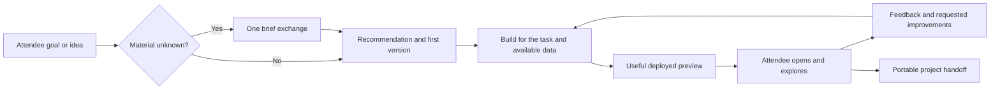

# Workshop Terminal: generated-app quality audit and remediation plan

Status on 10 October: **R01–R04 are closed; R05's live browser tasks have passed,
with garden attendee-identity confirmation pending; R06–R10
are proposed**. The owner
has refined the remaining scope around workshop pacing, one upstream UX skill,
creative freedom and thorough single-deployment qualification. Large-scale fleet
tests are excluded. After the WT work is complete, publish the final WT release,
then open a separate CT PR for Agent Bricks CLI/skill enablement and WT release
selection, defaulting to latest. This document changes the plan;
it does not claim those remaining runtime changes have been implemented.

R01 completed with a failed baseline against
`440232b953a5050c965838b42a594e1592ee3d33`, the then-current `main` and CT-pinned
WT `v2026.09.28.1` PEX revision. One eligible Claude/AppKit run
created a real bakery app from simple nontechnical inputs. Independent observation
proved missing scope agreement, an Invalid Date display, and offscreen mobile
status/action columns. Adding/packing worked through UI and survived reload/fresh
context; independent Lakebase storage proof and full acceptance remain unverified.
The [R01 closeout](remediation-validation.md#r01) records
receipts, inspected screenshots, limitations, and independently verified cleanup.
CT code and its working deployment are unchanged. R02 is accepted with recorded
follow-ups and implemented in PR #89;
R03 was closed by the project owner on 10 October after merging PR92
(`2cf9fdd`); its historical test results remain in
[its report](wizard-journey-r03.md). R04 preparation passed local/CI checks and
focused live Claude/Codex qualification on the reused Labs app; its
[closeout](preparation-r04.md) records results and limits. R05's
[delivery and live report](context-aware-ux-r05.md) records the Impeccable
installation, native discovery, failed first AppKit theme and subsequent repair.
Bring the focused R07 APX comparison forward after R05 closeout;
the framework default remains AppKit until that comparison. R06–R10
remain proposed. On 10 October,
the owner reduced R06 to preview handoff and attendee-led iteration; detailed
browser, UX and fault checks belong to development and release testing.
The [R02 implementation report](workshop-interaction-contract-r02.md)
records policy delivery, local regressions, model probes and live Labs attempts.
Browser tests qualified native Codex question transport and a static page, plus
Claude's bakery clarification, recommendation, packing and reload. The fresh
corrected package passed first-preview phone status/actions. Shared demo lookup
worked, but the agent missed a suitable working-catalog fixture and omitted
on-page sample/reset disclosure until a simple user repair request. Preserve
those failures: carry working-data delivery into R04, truthful generated-app defaults
into R05, and release regression coverage into R09/R10. Codex collector qualification,
broader generated-app quality and actual CT integration remain separate.

Audited on 8 October 2026 against commit `4d46461c6a0229892bdda5c153d8a6dd03d316c6`.
Scope: attendee onboarding, prompts, coaching, skill installation, project setup,
Claude/Codex/Omnigent instruction delivery, AppKit/APX guidance, UI patterns,
deployment acceptance, telemetry, CI, and workshop rehearsal.

At baseline qualification, CT's local Labs deployment bundle pinned WT
`v2026.09.28.1`, and the baseline package matched it.
The [CT provisioning comparison](control-tower-test-parity.md) records
the source versions, actual attendee/app-SP/model setup, simulation gaps, and
corrected R01 execution order. The original finding line numbers refer to August.
Before R02, the latest-source comparison confirmed the build-immediately and
no-browser policies, wizard UI, brief storage, and design-studio instructions.
R02 replaced the conflicting interaction/readiness prose; R03 subsequently
addressed the wizard flow and storage. Their reports retain the observed outcomes
and limitations; this plan does not reopen either completed workstream.
September added governed model selection and a resumable deployment MCP tool;
the August model-access/deploy-loop observations must not be attributed to this
release. Pi is absent from the current offered toolchain. Broader historical
findings need the same explicit version comparison before remediation.

## Recommendation

### Workshop pacing and scope

The workshop gives attendees a quick, compelling taste of what they can build.
The target is a polished working demo within the session. This guidance governs
the remaining work as well as the shared R02 contract. Keep detailed audit and
operator qualification checks separate from the attendee conversation.

- Start from the attendee's goal. If it is clear enough, recommend a small demo
  and build. Otherwise ask one or two consequential questions together in one
  short exchange; aim to spend about a minute shaping the idea. Reuse wizard
  answers and never treat a list of possible requirements as a questionnaire.
- Give one practical recommendation with a short reason. State the first version
  and sensible demo assumptions in a sentence or two, then proceed. Request a
  separate confirmation only when a consequential choice is unresolved; do not
  make every attendee approve a formal scope or proposal.
- Choose framework, component and storage defaults when the attendee has not
  expressed a preference. Explore prepared workshop data before creating sample
  data, and label sample data clearly. Preserve requested capabilities; defer
  unsolicited production architecture and extra features. If an integration or
  resource is unavailable, explain that constraint and suggest a workable demo.
- Get the main workflow on screen early and share the URL so the attendee can
  explore. Resolve obvious build/startup errors and respond to reported problems.
  Describe sample data and remembered changes accurately; deeper task and layout
  checks run during development and release testing.
- Adapt explanation to the attendee's experience. Prefer a compact walkthrough
  and an invitation to try or change the demo over more analysis. Mention material
  demo limitations briefly; do not turn the handoff into a production checklist.

The workshop quality floor remains real: readable and attractive presentation,
working primary actions, truthful data/state claims, and appropriate platform
permissions. Accessibility, fault, restart and rendered UX checks belong in
development, CI and thorough testing of one deployed instance. They must not
become a lengthy planning or approval ceremony for each attendee.

### Creative freedom and release scope

An attendee can bring an idea, choose a suggestion, skip onboarding, change
direction or start another build. Suggestions and release-test examples are
examples, never a catalog of allowed outcomes. WT supports apps, dashboards,
agents, notebooks, pipelines and other workshop-relevant Databricks work; the UX
skill applies when the result has an interface. Respect an explicit product,
framework or visual request. When permissions, available data or an external
dependency constrain the idea, explain the specific limitation and recommend a
useful demonstration of the same goal.

Shared rails cover access, current tooling, policy/skill delivery, project
continuity and deployment. Shared visual guidance sets usability and craft
expectations; it does not prescribe one app shell, palette, heading scale,
sidebar, KPI row or page structure. The audience, task, content and requested
tone determine those decisions. Reuse components where useful. Preserve a
coherent design within each app without making unrelated apps share a design.
Distinctness must improve the experience, rather than adding decoration or random
variation for its own sake.

The remaining release work stays focused:

- R04 prepares every offered path reliably; it adds no evaluation gate to opening
  a harness.
- R05 delivers one upstream UX skill and proves task-appropriate first previews
  across contrasting use cases.
- R06 shares previews and supports attendee-led changes as a small follow-up.
- R07 compares frameworks on representative builds; R08 preserves multiple
  projects and harness handoffs. Neither requires a new workflow engine.
- R09 adds focused regression coverage to existing CI; R10 thoroughly qualifies
  one deployment and the final CT-compatible candidate.

Additional persona axes, unoffered harnesses, numerical design scoring, a full
framework × model × persona × scenario matrix and a new acceptance/telemetry
service are outside this release scope. Large-scale fleet tests, staged concurrent
build campaigns and sixty generated-app builds are excluded. Preserve local
operational regressions and thoroughly exercise identity, isolation, credentials,
recovery and build quality on one deployment. Earlier runbook fleet procedures
are not requirements for this remediation. CT code stays unchanged during WT
remediation; the later requested CT feature PR is a separate step, and CT's working
Labs deployment remains protected throughout.

Each remaining workstream has a concrete change and focused acceptance checks
before implementation begins. Run a meaningful live test early, fix observed
failures, and close the item when those checks pass. Reuse completed evidence and
rerun only affected checks after fixes. Avoid extending a workstream into a new
evaluation campaign or treating every historical audit finding as a prerequisite.

Judge the remediation by real app builds. The original audit traced the observed
problems to explicit instructions to skip requirements validation and browser
checks. R02 changed that interaction contract. The remaining work must prove
current delivery and task-appropriate output rather than add more policy prose.

AppKit is the current default. Its strategic connection to the upcoming Genie app
builder is the workshop's stated rationale, not a compatibility guarantee verified
by this audit. Retain AppKit during remediation, deliver context-aware design
guidance, and compare it with a refreshed, pinned APX path on a representative
attendee task. Choose the default from working, usable previews and setup
reliability; treat Genie familiarity as a secondary goal.

The desired experience is: the attendee describes a problem; the agent helps
shape the product with a few useful questions and recommendations; the attendee
gets a polished, working app; the attendee explores it and asks for improvements.
The attendee should not need to name a framework, database, component, or testing
tool to receive this experience.

The existing simulator/test mechanics are in
[generated-app-e2e-acceptance.md](generated-app-e2e-acceptance.md). The current
release-test criteria below supersede broader campaign requirements in earlier
evaluation plans. A machine-readable example scenario is in
[novice-bakery-app.json](examples/novice-bakery-app.json).
The implementation status and simulation-first operating steps are in
[generated-app-evaluation-runbook.md](generated-app-evaluation-runbook.md).

The extended [onboarding-wizard audit](onboarding-wizard-audit.md) adds 40 detailed
findings and reproducible synthetic evidence. The wizard needs an optional
goal-first journey, stable request/selection state, preserved generated tasks,
useful recommendations, and recoverable launch. Choose whether to enable it from
the recorded R03 outcomes and a focused release smoke check of the intended event
configuration. Qualify skipped and disabled entry too; optional onboarding never
becomes a prerequisite for building.

## Evidence and limits

This section and the findings inventory retain dated audit evidence. They are
not an additional shipping checklist, and a historical unresolved test does not
reopen R01–R03. The current remaining scope is defined in the architecture,
workstream and release-test sections below.

The later R01 [isolated Labs evidence](remediation-validation.md#r01)
records genuine labuser authentication, all 419 runtime file hashes, and 20 real
synthetic orders. The plain bakery sentence could not advance without an industry;
selecting Retail preserved WT's build-now/one-question starter but encountered
native startup and model authorization blockers. The original attempts proved
Sonnet 5 exists while the test app SP lacked effective model EXECUTE access,
despite `/readyz` reporting ready. The
[later dated follow-up](remediation-validation.md#r01)
preserves five independently verified direct EXECUTE grants after further user
authorization. CT code, deployment, groups, and existing principals' permissions
were unchanged. The run window expired before an app-SP wire canary or generated
app was completed. The simulator must qualify an actual app-SP invocation before
treating a cell as a model-quality benchmark. No generated-app UX score or app
acceptance follows from this evidence. Recorded external evaluation
deployment/fixture/journey/result regression groups passed 289 tests; the later
focused independent-result suite passed 47 tests.

Three parallel audits covered runtime/harness delivery, design/framework guidance,
and onboarding/tests. Source findings below refer to the audited commit. Existing
tests were executed locally:

- 221 tests passed across `test_design_guarantee`, `test_project_setup_guarantee`,
  `test_user_content`, `test_wizard`, `test_wizard_llm`, `test_omnigent_config`, and
  `test_skills_provenance`.
- All 94 frontend tests passed with `node --import tsx --test src/*.test.ts`.
  The normal `npm test` command hit the sandbox's restriction on the `tsx` IPC
  socket; direct Node execution exercised the same test files successfully.
- An offline scaffold shim emitting a progress line reproduced the documented
  project-helper command-substitution failure. No real cloud scaffold was invoked
  for that reproduction.
- APX source was reviewed at commit
  [`a88ee32f22669eac0df57198006bdba7db44a878`](https://github.com/databricks-solutions/apx/tree/a88ee32f22669eac0df57198006bdba7db44a878).
- Extended wizard verification reproduced the compulsory industry gate, focus
  escape, and stale recommendations in the actual rendered component with a
  synthetic API. Offline contract execution reproduced ten save/handoff/discovery
  defects. The additional test groups passed but overlap earlier groups; see the
  dedicated audit for counts, scope, and retained evidence.

No real attendee-generated app, deployed screenshot, browser trace, or recording
from the 60-person event was available in the repository. No live cloud app build
was run for this audit. The pattern files were inspected but not independently
compiled or rendered here. Source establishes incomplete handlers and contradictory
policies; it does not establish which fragment a particular attendee's agent used,
or prove that AppKit itself is responsible for the observed appearance.
The event's wizard revision/configuration and recommendation traces are also
unknown. Local wizard reproductions establish failure mechanisms in the audited
code, not their incidence or relative importance at that event.

R01 now includes an external novice simulator, authenticated browser and harness
adapters, bounded journey orchestration, failure-preserving reports, a native
MLflow evaluation adapter, and direct Labs deployment with simulated CT inputs.
The optional runtime transcript observer is default-off and admin-only. Its
instrumented runtime snapshot is identified separately from the audited release;
unchanged prompt policy is an explicit assertion, not an exact-package claim.
Local adapter tests and a rendered HTTP/WebSocket smoke do not establish a live
novice-to-generated-app pass. Native pinned-CLI qualification, independent deployed
task/persistence/UX evidence, and complete executable runner wiring are still needed.

Testing proceeds on an isolated WT instance deployed directly into Labs with
fresh resources and simulated CT environment/bindings. The current instance is
bound to the genuinely authenticated labuser as a synthetic attendee; actual
CT assignment, model-caller provisioning, and event workspace isolation remain
separate qualifications. The earlier operator-bound receipt is preserved. Actual CT
provisioning/integration follows only after WT passes the isolated E2E gates.
Control Tower code and its working Labs deployment remain outside WT remediation.
The separate CT feature PR described below follows completion and the final WT
release; it does not authorize changes to the working CT deployment.

Priority definitions: P0 changes are needed to change the failed experience;
P1 changes are needed for dependable all-harness delivery and acceptance; P2
changes improve compatibility, observability, and portability. These are product
priorities, not security severity ratings.

## Findings inventory

### Requirements, recommendations, and onboarding

| ID | Priority | Evidence | Issue and impact | Workstream |
|---|---|---|---|---|
| F01 | P0 | `assets/instructions/CLAUDE.md:29-31,182-199`; `assets/instructions/lab_coach.md:21-34,61-77`; `assets/instructions/project_memory.md:93-96` | Base, coach, and project instructions tell the agent to build immediately, avoid requirements rounds, and correct misunderstandings mid-build. Advice is nominally encouraged, but the opportunity to give it is largely removed. | R02 |
| F02 | P0 | `server/wizard.py:533-565`; `tests/test_wizard.py:416-429` | The starter manufactures a build-now instruction that the attendee did not author. Card choice can replace the typed ambition entirely. Entry paths do not share one consultation contract. | R02, R03 |
| F03 | P0 | `server/user_content.py:277-339,390-399` | The late wizard overlay forbids restating requirements or clarifying. A change to the coach alone would still be contradicted by this overlay. | R02 |
| F04 | P1 | `server/wizard.py:82-105,128-136`; `frontend/src/components/Wizard.tsx:449-452,619-637,724-742` | The brief is onboarding/discovery context: goal sentence, industry, intent, persona, and stack. It lacks users, workflow, acceptance criteria, persistence expectations, consequential assumptions, and agreement. Even industry alone counts as content. "One sentence is plenty" works only if subsequent consultation fills these gaps. | R03 |
| F05 | P1 | `server/wizard_llm.py:182-185`; `frontend/src/components/Wizard.tsx:345-362`; `server/wizard.py:377-383,475-500,542-545` | Dynamic cards are not in the static catalog consulted on save. Their generated prompt/table metadata is omitted from the save payload and lost; a failed ID lookup also bypasses the industry-save branch. The next agent can receive a different, less grounded task than the attendee selected. | R03 |
| F06 | P1 | `assets/skills/databricks-apps/SKILL.md:68-98,191-197`; `assets/instructions/lab_coach.md:53-55` | Technical decision gates ask for Lakebase versus Analytics, resource choices, and fully qualified tables, while business coaching suppresses component names. Product requirements remain unvalidated. Advice must be framed as user outcomes, with identifiers discovered through tools. | R02, R03 |
| F07 | P1 | `assets/instructions/CLAUDE.md:211-213,301-303`; `assets/skills/databricks-app-design/SKILL.md:26-28,49-62`; `assets/skills/workshop-design-studio/SKILL.md:103-110` | All dashboards are described as AppKit builds while plain dashboard requests are routed to managed AI/BI. Data design asks for explicit tradeoffs/proposals while the studio says to present none. Missing precedence causes inconsistent consultation and output choice. | R02 |

### Design and executable defaults

| ID | Priority | Evidence | Issue and impact | Workstream |
|---|---|---|---|---|
| F08 | P0 | `assets/skills/workshop-design-studio/SKILL.md:64-93`; `assets/instructions/CLAUDE.md:288-293,305-340`; `assets/instructions/project_memory.md:103-120`; `assets/instructions/lab_coach.md:84-90` | A deployed URL is the main gate. Browser runs, smoke-test updates, validation, and design artifacts are expressly discouraged or prohibited. The only visual review is a cheap mental pass after deployment. No observed journey or UX evidence is required before claiming readiness. | R02, R06 |
| F09 | P1 | `assets/skills/workshop-design-studio/SKILL.md:20-23,95-110,141-159` | The studio conflates avoiding palette questionnaires with privately guessing the audience and primary task. It also supports only AppKit, so the optional APX path has no applicable common visual contract. | R02, R05, R07 |
| F10 | P1 | `assets/skills/workshop-design-studio/references/patterns/app-shell.tsx:24-25,40-43,65-66,85` | Navigation changes only a highlighted local flag; content does not route. The primary button has no action. These are incomplete fragments described as copy-ready defaults. | R05 |
| F11 | P1 | `assets/skills/workshop-design-studio/references/patterns/form.tsx:38,63-68,113,128-130`; `hero-first-run.tsx:18,44,48-50`; `states.tsx:154` in the same directory | Optional submit/action callbacks permit inert UI; form rejection lacks visible error recovery; Cancel/example actions are unwired; the sample remote success branch is blank. Depot validation is not associated with its control. | R05 |
| F12 | P1 | `assets/skills/workshop-design-studio/references/patterns/kpi-row.tsx:37-42`; `chart-card.tsx:32,52`; `states.tsx:114-122` in the same directory | Hardcoded KPI values, chart interpretations, provenance text, and a universal "database timed out/data safe" error teach plausible-looking but potentially false UI. The KPI pattern lacks required period/source/freshness fields. | R05 |
| F13 | P1 | `assets/skills/workshop-design-studio/references/patterns/app-shell.tsx:30-68`; `hero-first-run.tsx:43` in the same directory | Fixed horizontal chrome/action rows have no narrow-screen transformation. This is a responsive-layout risk requiring browser proof, despite the written narrow-window promise. | R05, R06 |
| F14 | P1 | `assets/skills/databricks-apps/references/appkit/appkit-sdk.md:89-93`; `references/appkit/frontend.md:47,151-158,174` | Minimal examples render a raw error/null, use generic cramped layout, or raw colors/platform branding. These undermine the stronger token, truthful-state, and brand-neutral instructions. | R05 |
| F15 | P2 | `assets/skills/workshop-design-studio/references/patterns/README.md:31-44`; `assets/skills/databricks-apps/SKILL.md:45`; `tests/test_design_guarantee.py:331-348` | Patterns claim verification against UI 0.50.0, while scaffolding controls the installed version. Tests check import strings rather than actual exports/props, compilation, or rendering. Compatibility is not continuously established. | R05 |
| F16 | P2 | `assets/skills/databricks-app-apx/SKILL.md:28-43,101,113-117,144-151,165` | APX instructions use an older installer, external shadcn MCP, stale tool names, `jq` despite its absence, and a bundles skill name inconsistent with this kit. An APX switch would currently introduce its own setup risks. | R07 |
| F17 | P2 | `assets/skills/promote/build-prompt.md:39-57` | Take-home guidance prescribes AppKit and workshop-only helpers even when the actual project uses another stack. It does not reliably carry the approved product brief or validation gaps into the next harness. | R08 |

These are defects or risks in the defaults, not evidence that every generated app
copies them unchanged. Validate design-skill improvements through actual generated
apps whose visible controls and states are exercised in development/release tests.

### Instruction delivery and project continuity

| ID | Priority | Evidence | Issue and impact | Workstream |
|---|---|---|---|---|
| F18 | P1 | `server/bootstrap/install.py:812-821,1702-1706,1753-1767` | Prewarmed skills reuse verifies only upstream skill names/digests and returns before refreshing workshop-owned assets. A design-studio update can be absent from a supposedly current persistent install. | R04 |
| F19 | P1 | `server/obo.py:289-290`; `server/omnigent_remote.py:323-352,565-590`; `server/users.py:103-119`; `server/main.py:804` | OBO can launch a remote host before local session creation, the sole production content-provisioning call. Opening the paired Omnigent UI first has no guaranteed coach/design skills/helper preparation. | R04 |
| F20 | P1 | `server/user_content.py:53-74` | Required-step failures are logged but the user is still marked provisioned, preventing subsequent retries in the process. A session can stay permanently missing mandatory content. | R04 |
| F21 | P1 | `server/bootstrap/install.py:364-389,2016-2045`; `server/main.py:758-768`; `server/user_content.py:537-548` | Launchability measures CLI binaries rather than the full build environment. Parallel installation can race platform tooling/skills, and a fallback skill linkage need not be reconciled after installation. | R04 |
| F22 | P1 | `server/user_content.py:416-455,527-530`; `assets/instructions/project_memory.md:6-9`; `server/bootstrap/install.py:48-56` | Home policy is duplicated into Claude/Codex, but isolated workers depend on committed project memory. Current project memory does not carry the attendee's evolving brief/decisions. Pi and upstream worker skill copying are not proven here; comments are not functional parity evidence. | R03, R04, R08 |
| F23 | P2 | `assets/bin/workshop-init-project:96-101,177`; `assets/instructions/CLAUDE.md:131-137`; `tests/test_user_content.py:348-410` | The documented `cd "$(workshop-init-project ... --appkit)"` captures scaffold progress/errors plus the path. A noisy offline shim reproduces the failure. Existing tests use silent success or accept a path suffix. | R04 |
| F24 | P1 | `assets/bin/workshop-init-project:104-109,125-145,174` | Existing AGENTS.md is not updated; an old marked CLAUDE.md is not migrated. Scaffold failure returns a plain project and commit failure is swallowed, even though worktree inheritance needs committed memory. | R04, R08 |
| F25 | P1 | `scripts/refresh_vendored_skills.py:37-47,114-119`; `assets/skills/SKILLS_SOURCE.md:34-49` | Refresh deliberately removes planning/verification skills and replaces upstream directories verbatim. Fixes made only in upstream-owned vendored prose can disappear. Home/project/coach/studio duplication also dilutes precedence. | R02, R04 |

### Acceptance, measurement, and testing

| ID | Priority | Evidence | Issue and impact | Workstream |
|---|---|---|---|---|
| F26 | P0 | `tests/test_design_guarantee.py:1-21,87-96,296-309`; `tests/test_user_content.py:113-150` | Tests acknowledge runtime quality is unchecked and actively pin deletion of gates plus post-deploy mental critique. They protect the behavior the attendee report asks us to change. | R01, R02, R06 |
| F27 | P1 | `tests/test_design_guarantee.py:315-392`; `frontend/package.json:7-10`; `.github/workflows/ci.yml:34-35,55-60`; `tests/conftest.py:83-98` | Pattern text checks, pure-function frontend tests, builds, and shell-substituted agent tests cannot assess rendered onboarding, agent consultation, or generated-app usability. | R01, R05, R06 |
| F28 | P1 | `scripts/regress_mode2.py:140-173`; `scripts/ct_two_instance.py:1528-1558`; `scripts/probe_omnigent_app_build.py:2-11,71-88`; `docs/verification-gate.md` | Live probes prove model/PTY or infrastructure setup. The build probe intentionally tolerates startup failure for dependency-installation proof. None is a novice-to-deployed-app acceptance test. | R01, R09 |
| F29 | P2 | `server/stats.py:189-221`; `server/telemetry.py:26-57,84-145`; `server/insight_summary.py:418-420,473-516` | Any commit can mean "shipped", including the initial scaffold commit. Quality stages, recommendations, requirements agreement, deployed task completion, and visual evidence are not tracked. Downstream summaries can overstate success. | R09 |
| F30 | P1 | `docs/omnigent-modes.md:11-17,96-120`; `server/bootstrap/install.py:48-56`; `deploy/omnigent-app/smart_routing.py:157-160,271-279`; `server/main.py:280-309`; `docs/model-comparison.md:52-56,110-125` | Routes/models have different capabilities: bare Codex is Responses-only, while offered Pi/Auto routes support other wires and already filter incompatible choices. Their app-building quality remains unmeasured. Managed modes are not workshop-supported; model-comparison documentation is stale against current routing code. An all-agents claim needs an exact supported path/model matrix and measured results, including Auto's actual selection. | R01, R07, R09, R10 |

### Extended onboarding findings

These entries summarize the detailed W01–W40 inventory in
[onboarding-wizard-audit.md](onboarding-wizard-audit.md).

| ID | Priority | Evidence | Issue and impact | Workstream |
|---|---|---|---|---|
| F31 | P1 | W01–W05, W19 | Mandatory industry, absent task-fit/consultation contract, ignored optional recommendation context, hidden capture explanation, and inaccurate readiness copy impair the novice journey. | R02, R03 |
| F32 | P1 | W06–W13 | Debounce, GET/POST, Surprise, and mutable-grid selection race; explicit clearing and static-only matching fail their intended contracts. Older input can determine visible ideas or overwrite selection. | R03 |
| F33 | P0 | W30–W34 | Dynamic task loss compounds F05; generated/static ID collision can launch a different product. Mutable pack lookup and concurrent saves violate stable task/record identity. | R03, R08 |
| F34 | P1 | W20–W29 | Forced shape variety displaces relevance; table-only checks overpromise feasibility; malformed output escapes fallback; serving lacks invocation failover/overall deadlines; fallback/order/counts and cold loads are unreliable. | R03, R09, R10 |
| F35 | P1 | W14–W18 | Save/launch/load failures do not provide truthful recoverable states; draft and selection can disappear. Modal labeling/focus and custom-sector interaction need rendered verification. | R03, R06 |
| F36 | P1 | W35–W39 | Independent wizard/discovery writers destructively replace context; clearing, capture/persona changes, disabled-state semantics, and isolated-worker propagation need explicit contracts. | R03, R04, R08, R09 |
| F37 | P1 | W40 | Passing static/dynamic/text tests miss the same-card round trip, rendered races, actual model wire, and real novice selection-to-app outcome. | R01, R03, R06, R09 |

## Strengths to preserve

Keep the one-workspace-per-attendee topology, credential rotation and recovery,
identity separation, resource-grant reconciliation, PTY reconnect behavior,
verified toolchain/skill provenance, typed SQL generation, manifest-first resource
discovery, current API-doc checks, semantic color guidance, KPI polarity, brand
neutrality, and Genie identity/SQL transparency. The existing operational tests
remain required; focused generated-app checks supplement them during release
qualification.

Keep onboarding short and skippable. Keep aesthetic decisions with the agent.
Do not restore a lengthy universal PRD or ask business attendees to choose
libraries. A compact product consultation is sufficient for simple workshop apps.

Commercial/account discovery and product requirements serve different purposes.
Requirements shaping must work when `LAB_COACH`, `DISCOVERY_ENABLED`, and insight
capture are off. Do not send newly captured product requirements to Control Tower
without the existing consent/configuration rules and a reviewed contract change.

## Target workflow

1. **Understand quickly.** Reuse wizard facts. Ask only what would materially
   change the demo's central task. Usually zero questions for a clear request,
   or one or two together for an ambiguous request. Use sensible defaults for
   ordinary implementation choices; aim for one brief exchange, about a minute.
2. **Recommend and frame.** Recommend a small first version and explain its user
   benefit in one or two sentences. State consequential demo assumptions. The
   attendee's request or answer can establish scope; a separate approval turn
   is needed only for an unresolved consequential choice.
3. **Choose internally.** Decide app versus managed dashboard and the storage/data
   path from the agreed outcome. Discover resource IDs through tools. Explain
   user-visible tradeoffs plainly; offer architecture detail when requested.
4. **Build for the task.** Use the framework's scaffold and components, apply the
   context-aware design skill, bind appropriate data, and implement the useful
   actions, routes and states selected for this particular app.
5. **Share the preview promptly.** Run the normal build/type checks needed to
   deploy, resolve obvious build or startup errors, and share the live URL. State
   demo-data and persistence limitations plainly. An immediately available,
   inexpensive smoke check is useful, but browser automation and UX review are
   not prerequisites for sharing the preview.
6. **Let the attendee explore and iterate.** Explain one thing to try, such as
   marking an order packed. The attendee plays with the app and tells the agent
   what failed or what they want to change. Respond to that feedback directly;
   do not start an automatic review/repair loop or require an acceptance ceremony.
7. **Hand off honestly.** Provide the URL, a short walkthrough and any material
   limitation. State only checks actually performed. Preserve the compact brief,
   source and actual framework for another agent.

For example, first ask: "What makes an order need attention?" After the bakery
answer, say: "I'll make a simple list with late, unpacked orders first and a button
to mark them packed. I'll use clearly labelled demo orders and remember updates,
so you can try the whole workflow." Then build. Ask about data only when the
attendee has requested a real source or the choice would materially change the
demo. This offers advice and a visible direction without a formal approval turn.

## Architecture and implementation decisions

### Help preferences for different experience levels

WT serves business users, data practitioners and software developers. The bakery
scenario is a deliberately nontechnical test of the minimum experience, not WT's
only audience. Current `server/user_content.py` seeds a binary business/technical
persona with a business default; the wizard exposes an optional choice. That
controls vocabulary but cannot express coding familiarity, Databricks familiarity,
or a preference for concise versus guided collaboration.

Use the shared workshop contract for everyone. Adapt explanation,
recommendation detail and pacing to the request and an optional help preference:
"Guide me", "Keep it concise", or "Discuss technical choices". An experienced
user's complete request can go straight to implementation once material choices
are known. The same usability, permission and truthful-state expectations apply
to each preference. Avoid inferring expertise from job title or the absence of a
toggle; observed familiarity may suggest a preference but is not a confirmed fact.

Reuse the existing optional preference/persona controls and let the attendee
change the help they want in the conversation, including with onboarding off.
R08 checks that the choice survives switching and reconnect without replacing
the project brief. Separate coding/Databricks familiarity axes, a new profile
schema and a multi-persona qualification matrix are unnecessary for this release.
Include a concise experienced-user request alongside the nontechnical release
test to catch repeated questions and unsolicited explanations.

### One canonical contract, with harness adapters

Reuse R02's shared workshop contract and existing project brief. Deliver concise
Claude, Codex, project and offered Omnigent adapters from that source. Keep
upstream skills intact and map platform/API guidance into the workshop workflow
explicitly. Add no parallel policy engine or competing brief schema.

Keep the internal brief compact and automatically maintained; its fields must
not become questions the attendee has to answer before seeing a demo. Record
known facts, the small first version and clearly identified assumptions. Expand
the brief only when the requested work needs it.

The working brief needs the current goal in the attendee's words, known audience,
main task, useful first version, actual data/state choices and consequential
assumptions or open decisions. Reuse R03's saved idea/provenance where present.
Omit unknown or irrelevant fields rather than filling a PRD. PRODUCT.md carries
product context into Impeccable and DESIGN.md records visual decisions; derive
their initial context from the existing brief and maintain changes together.
Avoid duplicate independent requirements records and new synchronization services.
Record what was stated versus inferred; do not call inferred requirements confirmed.

Commit the current compact brief and policy before worker delegation. Preserve
attendee-authored instructions; use versioned managed sections in CLAUDE.md and
AGENTS.md. Update the managed sections on resume/adoption. Runtime persona and
consent-sensitive information need not be committed; include only what is needed
for product continuity. Keep credentials and consent-sensitive workshop telemetry
out of the portable handoff by default.

Workshop Terminal launches third-party CLIs rather than owning every model turn.
Prompt text alone cannot enforce arbitrary tool use or prevent an agent bypassing
a helper. Enforce preparation and artifact integrity in runtime; exercise behavior
through focused real-harness and E2E release checks. Report only checks actually
performed; normal attendee builds do not need a verified-completion state machine.

### Shared preparation and versioned delivery

Use one idempotent preparation path for local session launch and remote-host
activation. Reconcile required instructions, skills, CLI and selected-path runtime
dependencies; retry failed steps and show a useful recovery action. Optional
conveniences may degrade independently. Evaluation qualification, wizard completion
and another project's build state must never gate opening a harness. Reuse
existing readiness reporting rather than creating a new workflow service.

Maintain separate upstream skills and workshop overlay digests. Reconcile overlays
and per-user links on release changes even when upstream content is reusable.
Record helper/policy versions. Prove delivery to enabled isolated workers against
the pinned Omnigent installation; do not infer it from home symlinks. Adding Pi
or another unoffered harness is separate work, not a dependency of this remediation.

Reserve helper stdout for a path or JSON result, send progress to stderr, return
explicit scaffold and commit status, and test the exact documented composition.
Name validation and existing-project migration belong in the same helper contract.

### One upstream UX skill and framework adapters

R05 adopts [upstream Impeccable](https://github.com/pbakaus/impeccable) as the
single UX skill, installed through its supported provider-specific delivery.
AppKit/APX supply scaffolding, components, APIs and platform integration. Retire
`workshop-design-studio` from active delivery and remove `databricks-app-design`
as a competing auto-discovered UX authority. Do not create a third design skill
or another collection of fixed app templates. The available Databricks-branded
Impeccable derivative is not the selected upstream package; attendee apps use
their supplied brand or a product-appropriate visual direction.

The conflict is broader than those two directories. Base, coach, project-memory
and promotion instructions repeat their mandates. `databricks-apps` requires
`databricks-app-design`, and the APX and AI/BI skills also reference it. Reconcile
these transitive routes explicitly in the single workshop integration policy,
while preserving vendored upstream platform/API files verbatim. Keep necessary
data correctness, units, periods, source/freshness and AI provenance guidance in
narrow technical references; those references do not choose layout, typography,
brand or the user's interaction flow. Confirm retired skills cannot return via
network installs, vendored fallback, refresh scripts, warm caches or old per-user
links. Verify actual discovery in each offered harness and isolated worker.

Reuse the attendee's request, saved brief when present, known audience, discovered
prepared data and requested actions to supply Impeccable's `PRODUCT.md` context.
Record facts and demo assumptions distinctly; do not fabricate audience, metrics
or evidence. Use its `DESIGN.md` for the app's visual decisions. Keep these aligned
with the project's brief when direction changes, with each build's context
separate. Distinguish attendee coaching preferences from the generated app's
audience. Closing or disabling onboarding must not prevent this context from
being captured from the ordinary conversation.

The upstream skill inspected on 10 October reports version 4.5.2 and distinguishes
Operate, Read, Persuade and Experience surfaces. Apply that context-sensitive
judgment: a packing queue foregrounds orders needing action; an analysis screen
foregrounds the relevant comparison; an interactive learning app foregrounds
exploration. Dense working screens need not have a giant heading or decorative
hero. Charts, KPI cards and navigation need a purpose in that particular app.

Use the [official installer](https://impeccable.style/tutorials/getting-started/)
with explicit providers and scope during WT preparation/project initialization,
not an interactive install initiated by each attendee. Qualify the latest release,
then pin the npm launcher, engine and exact skill bundle with license/provenance
and an offline/prewarmed path. Pinning only the npm version is insufficient: the
inspected installer separately resolves the current remote skill bundle. Its
supported `IMPECCABLE_BUNDLE_PATH` permits a captured, verified bundle to be reused.
Codex's upstream skill destination is `.agents/skills`, whereas WT currently
links skills into `.codex/skills`; preparation must reconcile that difference and
prove worker discovery. Support every offered harness through its actual provider path.
Use public npm sources in shipped configuration; the laptop uses its configured
Databricks proxy for local qualification.

Installing upstream unchanged does not by itself meet workshop pacing. Its
current init/new-work references require an answer/confirmation and can open a
visual-direction selection flow; choosing a code-first build alone does not
remove those interactions. The user's workshop contract takes precedence over
those workflow defaults. Reuse supplied facts, ask only material missing product
questions, and let the agent make ordinary visual decisions. Use code-first as
the workshop default. Keep upstream design guidance intact and the pacing/context
bridge small and centralized, rather than forking its aesthetic rules. A scored
review, concept tournament, image mockup round or repeated polish cycle is not a
prerequisite for an attendee's preview; richer exploration remains available when
the attendee asks for it.

The official installer also offers [automatic design hooks](https://impeccable.style/docs/hooks/).
Start qualification with the supported `--no-hooks` install path so skill quality
and delivery can be assessed independently. Evaluate lightweight detector hooks
separately for feedback value and actual time-to-preview; Codex hook trust and
worker loading must be verified before claiming they run. Local live-mode editing
is optional and cannot be assumed to work against a deployed HTTPS Databricks App.
Deeper browser/review testing remains development/release work under R06/R09.

Validate the actual generated first previews across contrasting scenarios and
harnesses in development/release testing: operational work, analysis and an
interactive experience. Review whether each UX fits its users, task and data as
well as whether it works. Compare information hierarchy, density, navigation and
primary interactions; changing colours and labels on the same sidebar/KPI/table
composition does not establish context-aware design. A packing queue should help
staff prioritize and act, an analysis screen should support comparison and
explanation, and a learning experience should invite exploration. These are test
examples, not prescribed app genres or visual recipes. Shared controls and useful
conventions are welcome; differences must follow the task and any attendee brief.
Retain screenshots outside Git. Pin the qualified skill,
framework and tool versions for the event. During the workshop, share the preview
promptly and let attendee feedback drive improvements under R06.

Quality requirements apply equally to AppKit and APX. Framework adapters own their
actual build/deploy commands and platform integrations; release-test criteria
do not mention a preferred component library. Both paths need real attendee
identity, app resource grants and appropriate data bindings. Persistence is
described accurately to attendees and exercised in starter/release tests.

### Attendee exploration and release verification

R06 is a small preview-and-iterate workstream. After the normal build/deployment
checks, the agent shares the URL, says what to try and describes demo limitations.
The attendee opens the app, explores it and requests fixes or changes. A readily
available smoke check may catch an obvious blocker; automated browser suites,
visual scoring, accessibility reviews and repeated repair loops do not delay the
attendee's first preview. No shared verification service or per-build acceptance
state machine is required for this release. Opening a harness and skipping the
wizard remain independent of any checks.

Thorough checks happen when developing R05's design guidance and qualifying the
release under R09/R10. Use the operator's test browser with genuine attendee
access to exercise tasks, persistence, narrow layouts, accessibility and injected
faults on disposable data. Keep screenshots and raw evidence outside Git. A
successful build or running deployment establishes availability; release reports
describe the functional and UX checks actually observed separately. Existing CT
telemetry semantics remain unchanged.

## AppKit versus APX: measured decision

APX supplies concrete affordances that should inform our framework and design guidance:

- A complete sidebar frame with a rail, user footer, sticky header, mode control,
  and padded bounded content region
  ([source](https://github.com/databricks-solutions/apx/blob/a88ee32f22669eac0df57198006bdba7db44a878/src/apx/templates/addons/sidebar/src/base/ui/components/apx/sidebar-layout.tsx)).
- Semantic light/dark, chart, and sidebar tokens
  ([source](https://github.com/databricks-solutions/apx/blob/a88ee32f22669eac0df57198006bdba7db44a878/src/apx/templates/addons/ui/src/base/ui/styles/globals.css)).
- Theme and toast providers in the root route
  ([source](https://github.com/databricks-solutions/apx/blob/a88ee32f22669eac0df57198006bdba7db44a878/src/apx/templates/addons/ui/src/base/ui/routes/__root.tsx)).
- Claude and Codex project guidance that asks for actual browser verification,
  typed API hooks, skeletons, and error boundaries
  ([Claude](https://github.com/databricks-solutions/apx/blob/a88ee32f22669eac0df57198006bdba7db44a878/src/apx/templates/addons/claude/CLAUDE.md.jinja2),
  [Codex](https://github.com/databricks-solutions/apx/blob/a88ee32f22669eac0df57198006bdba7db44a878/src/apx/templates/addons/codex/AGENTS.md.jinja2)).

These are useful implementation affordances, not a mandatory sidebar layout or
proof that every APX app is better. Reuse R01's completed baseline. Once the
Impeccable path works, compare AppKit and refreshed/pinned APX on a representative
task with the same brief, data, harness/model and resource conditions. Record
whether the main action works, the UX fits the task and a useful preview arrives
promptly. Repeat or widen the comparison only when a failure or an inconclusive
result warrants it; a blind scoring panel and full cross-product matrix are not
release requirements. Do not attribute combined policy and design-skill
improvements solely to the framework.

Choose the reliable default with the stronger task-appropriate preview and
reasonable workshop latency. Genie familiarity is a tiebreaker. A qualified
framework default helps attendees who want a recommendation; it does not override
an explicit compatible stack choice. No framework guarantees a good product
composition, and sharing a component library does not require sharing an app shell.

## Ordered remediation workstreams

R01–R03 rows retain the original scope for traceability; their owner-accepted
closeouts remain authoritative. R04–R10 define the remaining work.
The estimates below are planning ranges in engineer-days, not commitments. Browser
authentication and upstream Omnigent adapters are the largest uncertainties.
Review actual previews for usability and task fit; numerical design calibration
and a dedicated review panel are optional.

| Workstream | Deliverable and likely files | Depends on | Suggested owner | Estimate | Exit evidence |
|---|---|---|---|---|---|
| R01: Baseline benchmark | Completed failed baseline: eligible Claude/AppKit build, native-correlated consultation, real deployed app, independent UI task/screenshots and exact cleanup; WT-owned CT-compatible package runner and evidence in `evals/generated_apps/` and `docs/remediation-validation.md` | None | Evaluation engineer + harness engineer | 3-5 | Current-policy baseline from novice inputs with exact release/instrumentation identity; failures retained and independently classified; real deployed app or explicit failure verdict per run; CT integration qualified separately |
| R02: Workshop interaction and quality contract | Rewrite base/coach/project/studio policy around workshop pacing; shared concise framing; automatic compact brief; bounded prepared-data discovery; update contradictory tests and refresh allowlist | Accepted by the project owner on 9 October with recorded follow-ups. Native question/recommendation, action/reload and corrected first-preview phone checks passed. Working-data and first-page disclosure gaps remain for R04/R05/R06; Codex collector remains unqualified | Agent-experience engineer + product reviewer | 2-3 | Clear requests go straight to building; ambiguous goals usually need one brief exchange and a reasoned recommendation; existing data explored before invention; demo assumptions transparent; no routine approval ceremony or production planning; policy agrees across adapters |
| R03: Wizard journey and brief integrity | Goal/help-me-choose paths; optional industry; request coordinator/stable selections; versioned immutable static/dynamic snapshots and scoped IDs; atomic saves; recovery/a11y; recommendation/schema/dependency/fallback contracts; discovery/persona reconciliation; rendered tests. Detailed stages in the extended wizard audit | R02 contract; baseline from R01 | Full-stack engineer + product designer | 6-10, revised after extended audit | Plain goal can continue; obsolete requests never change current selection; suggestion → select → save → reload/restart → launch preserves exact task/industry/provenance; faults recover; relevance/feasibility gates and real novice-to-app journey pass |
| R04: Reliable preparation | Reuse one local/remote preparation path; selected-path dependency status/retry; digests and warm-install refresh; race reconciliation; helper stdout/status and managed-section migration. No evaluation or onboarding launch gate | Closed R02/R03 contracts | Runtime engineer | 3-5 | Fresh, prewarmed, redeployed, UI-first remote and recoverable failure paths receive current policy/skills/helper; noisy scaffold works; wizard skip/off permits normal harness use |
| R05: Context-aware app UX | One upstream Impeccable UX skill via its supported installer; pinned launcher/engine/bundle; project context from goal/users/data; retire studio and competing app-design routes, including warm installs and transitive mandates. Use AppKit/APX for scaffolds/components/APIs, with one small workshop pacing/context integration policy | R02 contract; R04 skill delivery; R03 goal context when present | Frontend engineer + product designer | Scope after delivery audit | Actual harness/worker discovery proves one UX authority; contrasting generated apps suit their users/tasks/data, have useful responsive first previews and working controls. Development/release tests verify results without an attendee design interview, mandatory concept picker or scored review loop |
| R06: Preview and attendee iteration | Prompt preview handoff after normal build/deployment checks; one useful action to try; clear demo limitations; accurate check claims; fixes driven by attendee feedback. Optional inexpensive smoke check, with no mandatory browser/review loop or acceptance service | R02 contract, R05 design guidance | Agent-experience engineer | Small follow-up; scope after R05 | An attendee receives the URL promptly, can explore and request a change, and gets a useful repair without waiting for a review suite. Development/release tests own deeper functional, UX and fault coverage |
| R07: Focused framework comparison | Refresh/pin APX CLI/skills and registry tools; compare a representative build with AppKit under the same UX guidance; select the event default | R04/R05 delivery and real previews | Tech lead | Scope after R05 trial | Main task, task-fit UX, setup reliability and time-to-preview support the choice; failures recorded; expand only if inconclusive |
| R08: Project continuity/handoff | Offered harness/worker delivery; existing brief/managed-section updates; switch/reconnect/worktree cases; visible active project, change-goal/new-build actions and return to earlier projects; recovery of workspace-backed projects after runtime replacement; framework-accurate portable promote output | R03/R04; reuse R05/R06 builds | Harness engineer | 2-3 | Build A, change A, build B separately, then return to A with correct context/files; switching, reconnect and onboarding-off work; a worker reads the actual skill assets; exported instructions match the project; local runtime resets do not silently strand an earlier workspace-backed build |
| R09: Focused regression coverage | Add regressions for changed delivery, skill precedence, wizard skip/off and project continuity to existing CI; a compact live-build release report; evidence outside Git. No new telemetry/acceptance service | R04/R05/R08 changes | Platform engineer | Scope after first UX trial | CI catches representative regressions; a few contrasting live previews demonstrate task fit, working controls and narrow-screen usability; observed checks reported accurately |
| R10: Single-deployment event qualification | Thoroughly test one immutable WT candidate on the reused isolated Labs deployment: attendee auth/permissions, offered harnesses, actual builds, UX, saved state, multiple projects, reconnect, restart, warm redeploy and recoverable failures; fallback/rollback instructions. No fleet/load campaign | Assembled remaining work | Workshop operator + tech lead | Reuse existing checks and deployment | One deployment works through the intended event journey and recovery cases; local operational CI passes; tool/release identity and observed outcomes recorded; ready to publish the final WT release |

Suggested milestones:

1. **Baseline:** retain R01's completed results as the comparison point.
2. **Behavior:** R02/R03/R04 prove useful consultation and consistent delivery.
3. **Quality:** R05 design guidance plus R06 give attendees useful previews whose
   UX fits their different goals; development/release testing checks the results.
4. **Choice:** R07 selects the framework default from measured outcomes.
5. **Release:** R08/R09/R10 prove continuity, focused regressions and reliable
   single-deployment operation; publish the final WT release.
6. **CT follow-up:** open the requested enablement/release-selection PR and verify
   CT-to-WT deployment on one disposable attendee deployment.

Run the first R05 app build as soon as the design skill is delivered correctly,
then use contrasting scenarios to qualify context-sensitive results. Written
guidance alone does not establish improved UX.

## Release and rollout

Use one reviewable PR per remediation workstream, starting with R03. Branch each
from current `main`; stack only when an unmerged dependency is necessary and
state that dependency explicitly. Keep evidence and known limitations with the
workstream that produced them. Merge each PR after review, local CI and its
appropriate isolated CT-compatible Labs checks. A merge does not deploy or
change CT's pinned workshop release.

Complete WT work and single-deployment qualification, then publish the final WT
release through the existing tagged PEX/manifest release workflow. Create the
separate CT feature PR after that release exists. Verify final CT-to-WT integration
using the released artifact on one disposable workshop/attendee deployment. Keep
the working CT deployment unchanged. If integration exposes a WT defect, fix it
in a focused WT PR and publish a corrected release. Merge workstream PRs after
their relevant checks rather than maintaining a growing stack until the end.

Use the existing release manifest to record the WT revision, instruction/skill
digests, framework/tool versions and resolved models used in the live tests. Keep
a compact outcome report linked to it; no new quality-matrix service or evaluator
version contract is required. Reuse the applicable local and single-instance checks
from `docs/verification-gate.md` and `docs/omnigent-acceptance-checklist.md`.
Their fleet/scale procedures are excluded from this release's acceptance scope.

For isolated Labs tests, reuse the owned WT test app and its provisioned compute
where practical, with separate project/data fixtures. Reset or create fresh state
only when a preparation/identity case requires it. Verify warm installs and
managed-section migration once against the release candidate and after relevant
fixes. Use the requested Claude Opus 5.5 and Codex GPT Sol 6.1 where available;
record the actual resolved endpoint/tool versions and explain any unavailable path.

Thoroughly test one deployment in the intended event configuration. Exercise real
attendee browser auth, app/model/data permissions, enabled/skip/off onboarding,
offered harness launches, distinct generated apps, saved changes, multiple builds,
switch/reconnect, token renewal, restart/warm redeploy and useful failure recovery.
Use existing local regressions and focused fault tests where they provide the
proof more directly. Record failing offered routes individually. Repeat affected
checks after relevant fixes; do not rerun completed suites by default. Run no
large-scale fleet tests or staged concurrent app-build campaign. Single-instance
qualification establishes the tested behavior, not a measured fleet throughput.

Check the launch paths actually enabled for the event, including bare agents and
any offered local/paired Omnigent path. A lightweight delivery/launch probe covers
each; representative real builds check generated output and worker delivery.
Qualifying unoffered modes or new harnesses is separate work. Recheck actual
offered workers and Auto routing from the deployed catalog. Test coverage selects
supported execution paths; it never limits the attendee's product ideas.

On regression, roll back the immutable release or deploy a pretested alternate
framework release through existing deployment controls. A new framework-switching
operator control is outside this release scope. Existing operator controls
can demote Omnigent to bare CLIs, but only if those fallback builds meet the same
app-quality bar. Do not quietly drop UX checks to keep a failing route available.

### Follow-up Control Tower PR after the final WT release

This is explicitly requested follow-up work after WT remediation and release,
not a change to CT during the remaining WT builds. Open one focused CT PR with:

- **Enable Agent Bricks CLI and skill:** an operator setting passes
  `AGENTBRICKS_ENABLED` to WT and uses the toolchain/skill packaged in the selected
  WT release. Preserve the current opt-in default unless the owner changes it.
  Enabled qualification proves the real CLI and `workshop-agent-bricks-cli` skill
  are usable in attendee harnesses/workers; disabled qualification confirms normal
  harness use and avoids advertising an unavailable CLI workflow.
- **Workshop Terminal release:** offer `Latest` by default and an explicit
  published-release selection. Latest means the latest published stable release,
  excluding drafts and prereleases. Resolve it once for the workshop deployment,
  record the exact tag, Git SHA and verified artifact/manifest identity, and reuse
  that resolution across retries and attendee provisioning. Existing deployments
  retain their recorded release until the operator explicitly changes it.

Reuse CT's existing immutable WT artifact validation/download/deployment path.
Display the resolved release to the operator. Reject an unavailable/incompatible
release clearly rather than silently falling back or selecting another version;
explain when a selected older release lacks Agent Bricks support. Preserve saved
explicit release selections and existing workshop configuration.

Test the CT configuration/resolution logic locally, then use one disposable
attendee deployment to verify latest/default, an explicit release and the Agent
Bricks option, reusing compute across redeploys where practical. Confirm the
enabled CLI can perform a useful agent/model/tool turn with correct identities.
The PR must not modify, redeploy or disturb CT's working Labs deployment.

## Release-test criteria for this remediation

Use a small representative set of real builds on the assembled release. These
checks run in development/release qualification; attendees receive previews and
drive changes through feedback. Expand coverage when failures or relevant changes
justify it, rather than running every scenario against every combination.

- Simulated nontechnical attendees describe contrasting goals through WT and real
  Claude/Codex harnesses, without technical rescue prompts. Include operational,
  analytical and interactive work on the selected default framework, plus a concise
  experienced-user request. Reuse the results for other checks where possible.
- The first useful previews fit their different users and tasks. Check structure,
  hierarchy, density and primary interactions, not just palette changes. Flag a
  generic shell reused inappropriately across unrelated goals. Open each preview,
  exercise its main action and inspect a narrow screen; numerical scoring and
  separate first-preview/final design panels are unnecessary.
- Observe data discovery before invention, clear demo-data disclosure and accurate
  storage claims. Exercise saved changes/reload when the app promises persistence.
  Add failure/restart checks where the changed implementation warrants them.
- Enabled, skipped and disabled wizard paths can launch an offered harness. Saved
  task identity survives relevant save/reload paths. Reuse R03's existing regression
  coverage; this is a smoke check of integration, not another recommendation campaign.
- A user can change A's direction, start B and return to A with the right files and
  context. A harness switch/reconnect and an enabled isolated-worker probe preserve
  the current instructions, skill assets and project context.
- The focused AppKit/APX comparison supports the default decision. Applicable
  local and single-instance identity, isolation, readiness, credential and recovery
  checks pass on the assembled WT candidate. No fleet-scale live test is required.
- Publish the tested final WT release, then open the CT feature PR above. Its
  single-deployment integration proves the requested release selection and Agent
  Bricks enablement without affecting CT's working Labs deployment.

R01–R03 remain closed with their recorded outcomes and limitations. R04–R10 must
deliver reliable current instructions/tooling, one UX authority, distinct task-fit
previews, project continuity, focused regressions and final deployment integration.
Publish the final WT release before beginning the requested CT feature PR.
The number of skills, policy pages or passing text assertions is not evidence of
better attendee output; the rendered working results provide that evidence.
