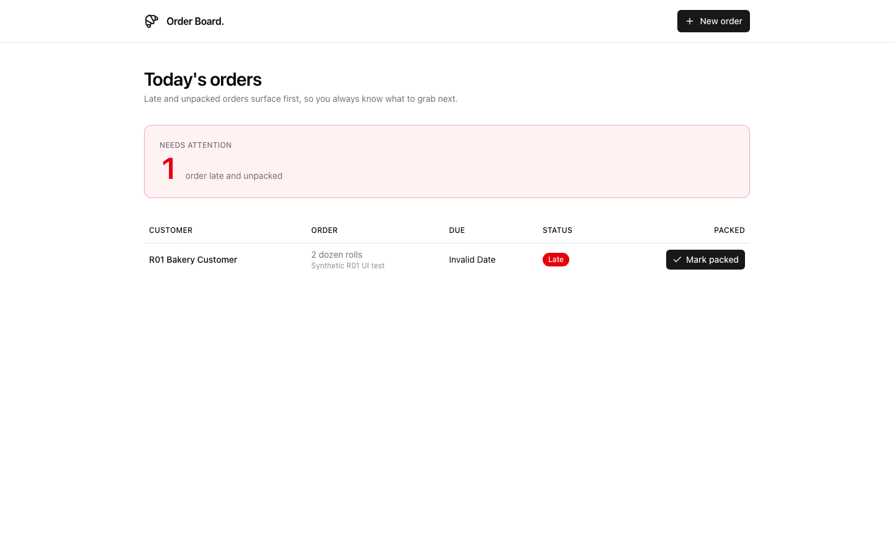
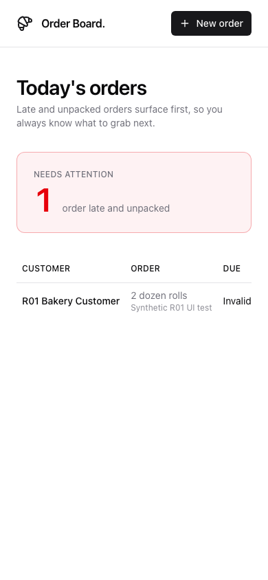

# R01 closeout — current-release baseline failed

R01 is complete on 9 October 2026. One eligible nontechnical attendee run created
and deployed a real app, and independent browser observation proved defects.
The generated app is **not accepted**. This closes the baseline work item; passing
product remediation, the wider harness matrix, and CT integration remain separate
work under R02–R10. No failure rate is estimated from this single cell.

## What was exercised

- The unchanged CT-pinned WT `v2026.09.28.1` PEX, source revision
  `440232b953a5050c965838b42a594e1592ee3d33`, with separately hashed external
  observation code and unchanged build policies.
- WT-owned CT-compatible provisioning in Labs: package/toolchain staging,
  assigned-attendee app access, OBO scopes, own-SP model policy and real inference,
  catalog/build permissions, warehouse access, and attendee work-sync access.
  Direct grants to the disposable SP replace permanent CT group membership.
- Genuine `labuser+1@awsbricks.com` browser identity; ordinary wizard Skip and
  Claude `2.1.283` terminal entry, starting with independently verified empty
  projects. AppKit `0.76.1` and a new Lakebase project were chosen by the builder.
- Actual browser creation of one synthetic order, one packing action, reload,
  and a fresh authenticated context. No technical rescue, app repair, redeploy,
  or backend data write was supplied by the evaluator.

The exact opening was:

> I run a small bakery. Can you make a page so I know which orders need attention?

The agent asked how orders were tracked and what needed attention. The simulator
answered only those facts:

> Orders that are late and haven't been packed yet. Show those first. We use a spreadsheet and keep asking each other what's ready.

[Journey 13](journey-13.json) independently correlates both messages with the
native conversation. Deployment was observed after approximately 621 seconds.
The runner closed its exact native session. Journeys 1–12 remain excluded setup
attempts with their original receipts, bounds, and classifications.

## Baseline findings

| Check | Actual result | Evidence |
|---|---|---|
| Useful clarification | Observed. The statement that this release never asks questions is too broad. | `journey-13.json`, complete assistant/user messages |
| Agreed scope before building | **Failed.** After the workflow answer, the next authored response reported deployment. No scope agreement was delivered within the consultation window or before deployment. | `assessment.consultation` and native-correlated messages in `journey-13.json` |
| Real generated deployment | Verified: new `bakery-orders`, created by the disposable WT SP, with a new Lakebase project owned by that same SP during this run. | `generated-app-final-binding.json`, `generated-app-cleanup-plan.json` |
| Deployment continuity | The active deployment advanced after discovery. Both IDs are retained; all 41 files in the original and final snapshots have identical size and SHA256. The original journey was not rewritten. | `generated-source/manifest.json` |
| Add and pack an order | UI creation returned 201; the single packing request returned 200. The packed status survived reload and a fresh context, with fresh app GET responses. | `generated-app-ui-task.json`, `generated-app-packed-followup.json` |
| Due-date presentation | **Failed.** Entering `2026-10-08` produces a response date `2026-10-08T00:00:00.000Z`, but the rendered row says **Invalid Date**, including after reload/fresh context. | Desktop/tablet screenshots, ARIA, actual response observations; `generated-source/final/client/src/App.tsx`, `formatDue` |
| Mobile workflow | At 390px, status and packing controls are initially offscreen. The packed control starts at x=491.9px; normal horizontal scrolling reveals it. The table scrolls within a 342px container over 550px content, while page overflow reports false. This needs a deliberate responsive treatment. | `generated-app-mobile-layout.json`, mobile screenshots |
| Independent storage persistence | **Unverified.** The implemented storage oracle binds the externally seeded UC table; this app uses Lakebase. Fresh app responses and browser contexts are not independent storage reads. Choosing Lakebase is not itself a failure. | UI/task receipts; `seed-final.json` |
| Calibrated UX score, restart, faults, full accessibility, measured token/spend limits | **Unverified.** Screenshots were visually inspected at 1440/768/390px, but no calibrated multi-reviewer score or acceptance pass is claimed. | Preview/final screenshots and receipt limitations |

The empty screen is orderly and readable; this run does not prove that every
AppKit app is visually terrible. It does prove that successful compilation and
deployment leave a visible date defect and a poorly exposed mobile task. The
first independently observed app preview was the empty deployed app; intermediate
builder previews were not captured.

## Evaluator corrections are kept separate

The first result attempt rejected a legitimate read-only fixture rebind; the
validator now accepts that operation only with preserved bounds, no mutations,
the previous deployment binding, and unchanged package evidence. Its focused
suite passes 58 tests.

The first generated-app visit reached normal platform consent. The assigned
identity and default identity scopes were checked before normal authorization;
no operator bearer was injected. The first packed-status assertion matched both
the status cell and the button-containing cell. That failed collector receipt is
retained; the followup used a unique status cell and performed no further writes.
Neither collector issue is counted as a product failure.

The earlier jumping behind the wizard came from the evaluator retrying a
background agent-card click during the asynchronous wizard decision. The driver
now waits for authoritative wizard/modal state and uses normal Skip. The rendered
delayed-response regression passed. This does not qualify the wizard's idea/CUJ
journey, which remains R03 work.

## Cleanup and CT protection

Cleanup finished before the original `2026-10-09T03:32:15Z` expiry. No window was
renewed. Final independent readback verifies absence of both apps and their app
SPs, the generated bundle/snapshots, the Lakebase project, WT source, disposable
catalog/runtime volumes, and temporary operator group. The exact model/schema,
warehouse, and work-sync grants were removed with other principals preserved.
The attendee's existing `projects` directory retains its original identity.

The platform automatically removed generated-app snapshots when the app was
deleted; the first explicit snapshot deletion therefore met an already absent
path. Lakebase soft deletion retained a tombstone, which was identity-checked and
purged. A receipt serialization error after the purge request is preserved;
independent readbacks establish the final absence.

CT code, events, configuration, deployment, and permanent groups were not changed.
The reviewed CT checkout remains clean at
`3d610173812ebbd71ed63c2e3f6d7210baf96fac`, with all reviewed file hashes unchanged.
Apps metadata confirms CT stayed RUNNING/ACTIVE on the same deployment
`01f1bbc1de2911cb93356caa765f77a3`. There were no requests to CT's service API.
Both private evaluator authentication exports were removed and never archived.

- [WT teardown](wt-cleanup.json)
- [Generated-resource teardown readback](generated-app-cleanup-readback.json)
- [Final independent resource and CT readback](final-resource-readback.json)
- [CT source verification](ct-source-closeout.json)

## Validation and next work

The prior full Python run passed 2,656 tests, with two skips and seven localhost
probes deselected. Those seven probes passed separately with scoped loopback
access; the rendered browser regression passed. After the result-validator
correction, its focused suite passed 58 tests. These are evaluator/runtime checks,
not generated-app acceptance evidence. Logs are archived alongside the receipts.

R02 is the next build item: one shared consultation and scope contract, with
explanation/help adapted to experience level and the same quality floor for all
attendees. R05 must supply a tested date/data contract and responsive operational
queue starter; R06 must exercise actual rendered tasks and persistence before
completion. R03 still owns wizard repair. The broader harness/framework matrix
and later CT-integrated test remain explicit qualification work; this one failed
Claude/AppKit cell does not qualify them.
