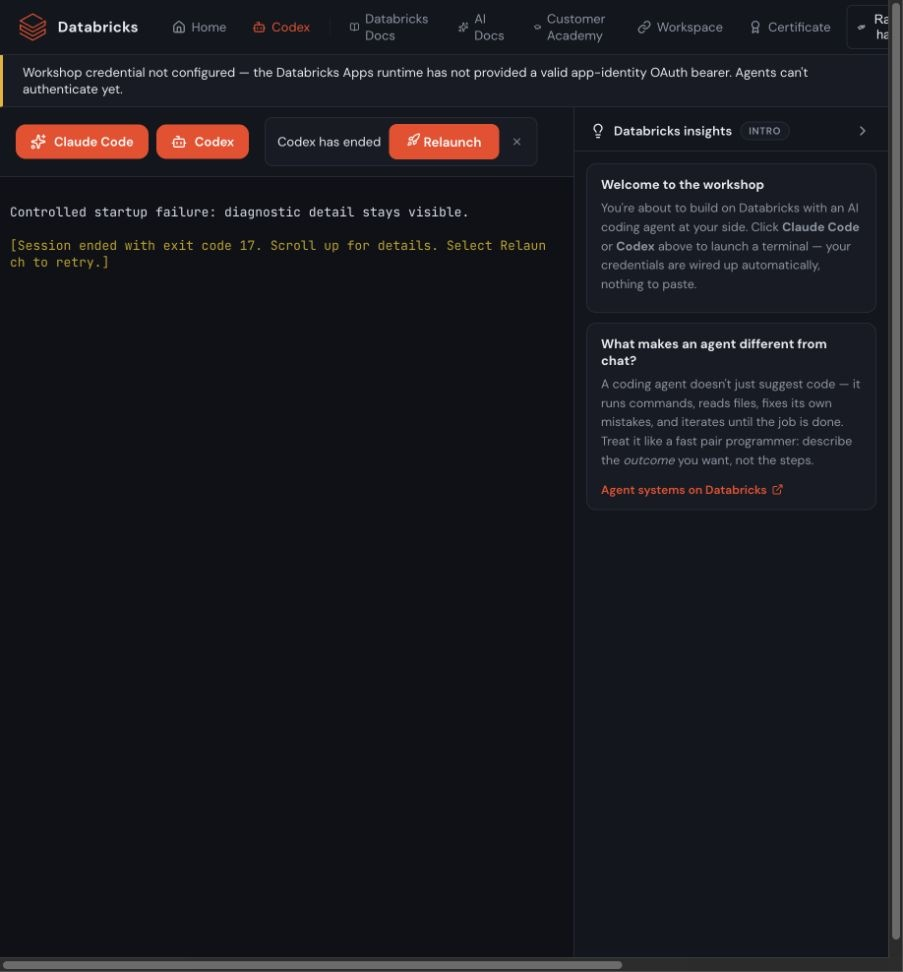

# Codex startup and coach hint repair, 9 October 2026

The coach hint claimed readiness immediately after PTY creation and loaded an
immediate-build request for an attendee who had not chosen an idea. It now says
to wait for the prompt and offers two small demo ideas, one recommendation and
one choice. The starter stays unsent until the attendee presses Enter. This is
a short workshop exchange, not a requirements approval gate or experience quiz.

WT also removed an exited terminal immediately, hiding its final output. Ended
terminals now retain that output in the existing browser tab, display the exit
code/signal and offer Relaunch. The live server slot is released. Ended terminals
do not receive input or trigger switch confirmation; output is not persisted in
the server journal. The socket closes after its final output and status frame.

## Native Linux diagnosis

The earlier genuine-labuser test had two Codex exits before a usable prompt.
WT had installed both pinned Codex packages from checksum-verified UC blobs.
The subsequent “Installing daemon” line came from Codex copying its installed
package into the attendee's `.codex` directory, not another registry download.

A separate disposable Linux App used the same `0.157.1` tarballs and verified
their package and executable hashes. It ran `codex app-server daemon start`
with synthetic, credential-free config and submitted no model turn. The same
long HOME used by the failed WT deployment reproduced `path must be shorter
than SUN_LEN` in about 12 seconds. A short HOME with the same synthetic provider
config succeeded. A long HOME with default config also reproduced the socket
failure, separating it from the deliberately empty synthetic auth token.

The pinned daemon server already shortens its physical socket, but the client
passes the long advertised pathname to connect. The initial source-only
interpretation that this ruled out a path-length failure was incorrect; the
Linux probe established the client-side failure.

WT now gives only a direct Codex session a short lexical HOME symlink. The
original HOME, projects cwd, config, credentials and native-log files stay in
place. `CODEX_HOME` cannot provide this workaround because the pinned CLI
canonicalizes it. Apps uses a private `.cx` directory under its source root;
development paths can use an owned `/tmp` alias. Existing unexpected links,
owners or exposed alias directories are rejected without replacing them.

| Native probe | Outcome |
| --- | --- |
| Original-length HOME, synthetic workshop config | Exit 1, socket pathname too long, 11.431 seconds |
| Short HOME, same config | Exit 0, 1.409 seconds; temporary-directory helper warning |
| Original-length HOME, default config | Exit 1, socket pathname too long, 11.704 seconds |
| Short alias to the original HOME | Exit 0, 0.540 seconds; temporary-directory helper warning |
| Exact committed WT helper using private Apps alias | Exit 0, 1.699 seconds; 102-byte control path; original HOME resolution verified; no temporary-directory warning |

The exact helper was uploaded byte-for-byte from `server/codex_home.py`; its
hash is recorded with the probe sources. A diagnostic-only continuation failed
on re-creating its old temporary symlink before reaching the exact-helper cell.
That failed result is preserved, and the corrected final probe ran only the
exact-helper cell. The production helper already supports reuse of the exact
owned alias. No pin was changed and no auth state was exported.

## Browser and local validation

Computer/Browser drove a controlled localhost fixture, not a native model:
the revised banner appeared, the starter was inserted unsent, normal Enter
submitted it, a controlled exit retained its detail/code, Home navigation kept
the ended terminal, and Relaunch opened a fresh session without confirmation.
Screenshots identify the fixture visibly. These checks establish UI behavior,
not generated-app quality or actual Claude/Codex model behavior.

The focused backend suites passed **76 tests**. All **107 frontend tests** passed
and the locked Vite `8.2.2` production build succeeded. The laptop's npm fetch log
recorded all 35 package downloads through `npm-proxy.cloud.databricks.com`;
public package identities remain in the committed lockfile. Python tests reused
the existing virtualenv. The runbook now explicitly separates local proxy
installation from public CI/runtime sources.

## Limits and cleanup

This is a native daemon diagnosis and a local UI repair check, not a fresh
CT-compatible WT package journey. The full Codex TUI, model reply delivery and
Omnigent's separately managed Codex homes still need qualification. No generated
app was built. The earlier Claude plain/structured Browser qualification remains
valid; its previous long-build collector failure is still unexplained.

Only the disposable diagnostic App, workspace source and automatically created
test principal were provisioned. The app deletion was requested before its
900-second expiry; platform `DELETING` state is not treated as absence proof.
Final cleanup readbacks and the unchanged CT deployment/source hashes are
archived separately. CT code, configuration, events and permanent groups were
not changed. No diagnostic package or browser authentication state is archived.
