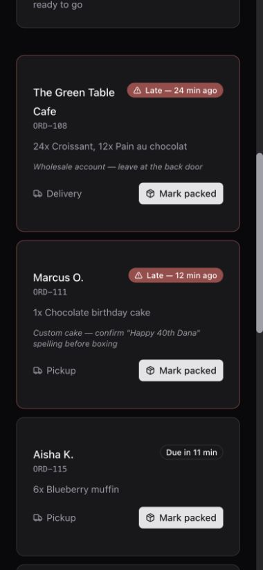
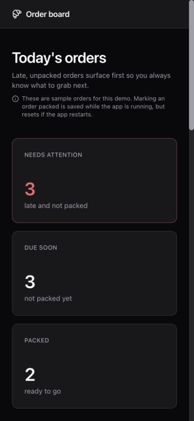

# R02 corrected-package native run — 9 October 2026

R02's interaction-contract implementation was accepted by the project owner with
recorded follow-ups. This is a workstream decision, not a passing verdict for
every observed generated-app criterion or the assembled release.

A genuine `labuser+1@awsbricks.com` used Computer/Browser with wizard capture
and the wizard disabled. All 445 runtime files in the deployed immutable PEX
independently matched `4c8b8d761037bb9b785750acac3e9a52d935bb07`.
Native Claude `2.1.283` used Sonnet 5. The shared `workshop_demo` catalog and
exact temporary generated-SP read access were qualified without changing CT.

The opening was “I run a small bakery. Can you make a page so I know which orders
need attention?” The agent asked one consequential question, recommended overdue
and not-yet-started orders with a reason, and received “Orders that are late and
haven't been packed yet. Show those first.” The exchange took about 47 seconds.
The collector was ready and correlated the exact question, answer and later
repair. Tool/worker attribution, implementation timing and native transcript
authenticity remain unverified by that collector.

## First preview

| Check | Result |
| --- | --- |
| Late/unpacked orders first, valid due times | Pass |
| Desktop packing and reload | Pass: ORD-104 became packed, moved and remained packed |
| Phone status/action without horizontal scrolling | Pass: cards; 390px viewport, 380px document width |
| Phone packing and reload | Pass: ORD-108 became packed, moved and remained packed |
| Shared prepared-data exploration | Observed: DESCRIBE retail orders and SHOW TABLES |
| Relevant working data inspected/reused | Fail: suitable existing 20-row bakery fixture missed |
| On-page sample/reset disclosure | Fail: absent from the first page |
| Continuity brief in first deployed source | Empty scaffold placeholders; later deployment contains the filled brief |

The shared retail table lacked due-time and packing fields. That explains its
rejection, but does not justify ignoring
`wt_eval_r02_1009_fdae.generated_apps.bakery_orders`, whose 20 rows had matching
fields. No technical fixture hint was sent during this run. Working-data context
and brief delivery continue under R04; truthful starter defaults under R05;
observed first-preview completion under R06.

An initial browser consent callback showed 403 before the deployment helper
finished. Retrying the normal app root after completion opened the app without
any manual permission rescue. The cause of the initial error was not proven.
The original access-error screenshot is retained; no callback query or auth code
is archived.

## Bounded repair

An ordinary request asked: “Can you show on the page that these are sample orders
and that packed changes reset if the app restarts?” The agent updated the page,
built and redeployed. The notice was verified on desktop and phone. Redeployment
reset the earlier packed changes, consistent with server-memory storage.
The original preview failure remains a failure. Source snapshots identify both
exact deployments and hash every downloaded file.

No new runtime changes were folded into this evidence-only closeout. Earlier
runtime fixes and their CI evidence remain in PR 89.

## Scope

This is one representative native Claude bakery build, alongside the earlier
Codex transport/static-page control. It does not qualify the wizard, every
harness/model, actual CT integration, deliberate restart/fault handling,
calibrated visual quality or event concurrency. Spend was not measured or
enforced. The original 1800-second journey bound and WT expiry were not extended.

## Verified cleanup

The exact bakery app/SP and two test source directories were removed. Its
recorded shared-demo read privileges were explicitly revoked before deleting it;
other principals were preserved. WT's exact app/SP, source, catalog and temporary
group were removed, and its shared model/demo/warehouse/project access deltas
were revoked. An independent readback verified absence, the original attendee
projects directory ID `1462869392157865` and its empty inventory, unchanged
`workshop_demo` identity, and CT still RUNNING/ACTIVE on deployment
`01f1bbc1de2911cb93356caa765f77a3`. All seven reviewed local CT source hashes
matched. Only the platform-owned `.db_internal` remains in the old WT-SP home;
it was intentionally untouched.

Authentication state and transcript continuation cursors are excluded from the
archive. `hashes.json` covers the archived evidence bytes.
