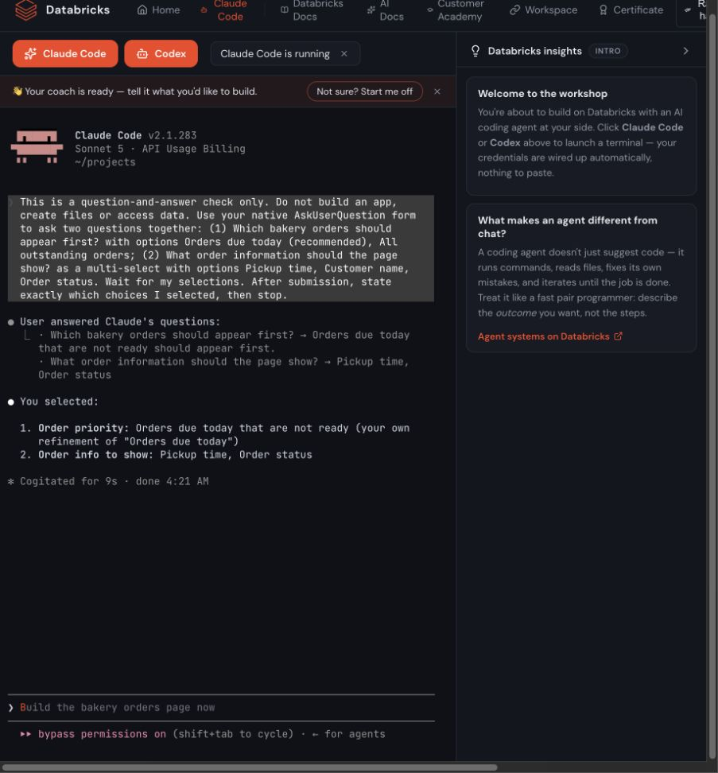

# Direct browser question-delivery qualification, 9 October 2026

Computer/Browser drove the actual WT terminal as `labuser+1@awsbricks.com` on a
fresh CT-compatible Labs deployment. Claude's plain-text and structured-question
paths both delivered the intended answers and produced correct acknowledgements.
The native collector also captured the questions before submission and correlated
the replies in these controlled probes. This qualifies a direct browser route for
the next Claude build test; it does not resolve the earlier missing-log failure.

## Results

| Cell | Actual UI result | Collector result | Elapsed |
| --- | --- | --- | --- |
| Claude plain text | Asked which bakery orders should appear first; received the ordinary business reply; acknowledged it correctly | Opening, question, reply and acknowledgement captured | 68.293 seconds |
| Claude structured form, first attempt | Operator pressed Enter on an empty inline `Type something` editor, cancelling the form | Pending two-question form captured; cancellation returned `unsupported_native_question_answer` | Preserved as an operator input error, excluded from quality scoring |
| Claude structured form, fresh retry | Custom priority answer and two selected fields were verified on the review screen, submitted through the terminal and acknowledged correctly | Pending question set, custom reply, both selections and acknowledgement captured | 129.670 seconds |
| Codex plain text | Two native startup attempts exited before a prompt; no test opening was submitted | App lifecycle logs recorded `process_error` after 12 and 10 seconds; classified diagnostics contained no errors | Question delivery unverified |

The elapsed times come from independently collected opening/acknowledgement
timestamps. Both completed Claude cells fit the predeclared 180-second bound.
The structured retry answered the priority question with “Orders due today that
are not ready should appear first.” It selected `Pickup time` and `Order status`,
leaving `Customer name` unchecked. The review screen and final acknowledgement
are archived separately, so selection delivery is not inferred from defaults.

## Method and deployment

- The predeclared [protocol](qualification-criteria.json) forced questions without
  requesting an app, files or data access. It is operator test plumbing, not a
  new attendee requirement or a test of R02's natural clarification behavior.
- CUA read the live DOM and screenshots. Clipboard paste and normal terminal
  keystrokes submitted all inputs; no request injected a reply into the harness.
- The native-log endpoint was a separate read-only comparison. Its output did
  not drive CUA's choices. Screenshots and DOM snapshots retain UI provenance.
- WT used the previously verified immutable R02 package, with all 444 runtime
  files matched to `28c80f1`, and the current separately hashed observer. Claude
  was `2.1.283` using Sonnet 5; Codex startup identified `0.157.1`.
- Model qualification independently invoked the driver, Codex and wizard routes
  as the exact fresh WT service principal. A successful gateway canary did not
  qualify the Codex terminal, which subsequently failed at startup.
- No browser cookies, authentication state, raw native tool/worker logs or raw
  platform logs enter this archive. Codex lifecycle evidence is reduced to
  timestamps and the fixed `process_error` classification.

## Limits and next test

The earlier tool-using bakery run's missing primary assistant records were not
reproduced or explained. These probes establish neither collector reliability
during long builds nor the automated runner's complete interaction handling.
Its legacy scope-agreement consultation criterion remains unsuitable as the
pass condition for this transport test. Codex and Omnigent question delivery
remain unqualified. No model-quality score or generated-app UX score is inferred.

The next Claude bakery test can use the qualified Computer/Browser route to
observe visible questions, answer with ordinary bakery facts, and independently
inspect the generated app. Collector gaps should be recorded separately from UI
behavior. The app's useful task and rendering, and later CT integration, still
need real acceptance evidence. No generated app was built in this probe.

The receipt-owned WT resources were cleaned after the probe. Independent
cleanup/CT readbacks and archive hashes are recorded alongside this report.
The original R01 baseline and all three R02 build-attempt archives remain intact.
