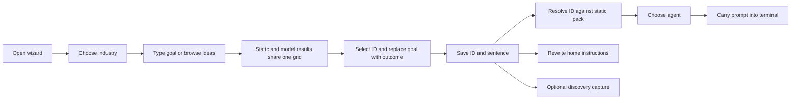
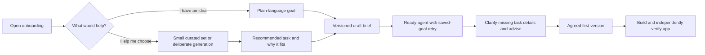

# Onboarding wizard: extended audit and remediation

Status: extended audit retained; R02 unifies starter framing and permits useful
clarification in the agent handoff. R03 flow, recommendation, and persistence
fixes remain proposed. The wizard has not been re-enabled for events.
Audited on 8 October 2026 at `4d46461c6a0229892bdda5c153d8a6dd03d316c6`.

Companions: [overall remediation](app-quality-audit-and-remediation-plan.md) and
[novice-to-generated-app acceptance](generated-app-e2e-acceptance.md).

## Decision and confidence

The wizard is fixable within the app-quality remediation, but it needs changes to
the product flow, request coordination, recommendation contract, persistence, and
agent handoff. A different model or better card wording alone cannot fix it.
Keep it disabled for events until the gates below pass. Skipped/disabled onboarding
must still lead to the same useful agent consultation and app-quality contract.

We now understand concrete failure mechanisms, including ones reproduced in the
actual rendered component and offline backend execution. We do **not** yet know
which mechanisms dominated the event: its deployed revision, effective settings,
model responses, latency, and suggestion-to-launch traces were not available.
The findings establish current-code defects and risks, not a retrospective
attribution of every attendee's experience.

The most consequential combination is:

1. A complete plain-language goal cannot advance without a confirmed industry.
2. Recommendations optimize technology variety and table availability without a
   clear contract for the attendee's central task.
3. Responses from earlier input can replace newer recommendations; selection is
   only an ID into that changing grid.
4. Generated cards lose their full task and confirmed industry at save; an ID
   collision can substitute a different static task.
5. The surviving handoff explicitly tells the coding agent to avoid consultation
   and begin building. This compounds the broader generated-app quality problem.

## Evidence collected

Three parallel audits inspected the rendered flow/state, generation/selection,
and persistence/discovery/handoff contracts. Root verification added browser
checks against the actual `Wizard.tsx` and shipped stylesheet with synthetic API
responses. There were no live gateway calls, real attendee data, or cloud builds.

| Evidence | What it establishes | Limit |
|---|---|---|
| Actual source component in Chromium | Typing the bakery goal leaves Next disabled; Tab exits the modal; an older bakery recommendation appears beneath a new staff-shifts goal. | Isolated browser harness with controlled synthetic API/timing; not the complete WT runtime. |
| Actual transpiled component with controlled hooks/timers | A pending suggestion survives card selection and Next; an older in-flight response remains eligible after text changes. | Executes component handlers/state, without browser rendering. |
| [Offline contract reproducer](evidence/onboarding-wizard/reproduce-contract.py) and [results](evidence/onboarding-wizard/contract-reproduction.json) | Ten current-defect demonstrations covering generated-card loss/collision, mutable prompts, discovery replacement/clearing, concurrent saves, capture, and persona divergence. | Models/catalog access are mocked, homes are temporary, network connections blocked. Assertions document existing broken behavior; they are not acceptance tests. |
| Offline generation probes | Malformed lists raise TypeError; empty dependencies can hide nonexistent prompt tables; irrelevant shape fillers displace relevant cards; fallback reshuffles; no invocation failover; duplicate concepts and misleading counts survive. | Executed inline during the audit, without saved probe script/output; not covered by the linked contract reproducer. Synthetic output/dependencies, without real model quality judgments. |
| Existing tests | 129 focused wizard/admin/user-content/content tests and 29 generation/admin tests passed in the extended audit. | These groups overlap and must not be summed into a unique test count. Passing tests do not exercise the full wizard CUJ. |

Browser artifacts: [industry gate](evidence/onboarding-wizard/industry-gate.png),
[accessibility snapshot](evidence/onboarding-wizard/industry-gate-accessibility.txt),
[stale recommendation](evidence/onboarding-wizard/stale-suggestions.png), and
[observation details](evidence/onboarding-wizard/browser-observations.json).
All cards, users, and responses in these artifacts are synthetic. The rendered
checks demonstrate current behavior; they do not independently score the visual
quality of live generated ideas or apps.

Run the offline demonstration from the repository root with the existing Python
environment:

```sh
.venv/bin/python docs/evidence/onboarding-wizard/reproduce-contract.py --output /tmp/wizard-contract-reproduction.json
```

After remediation, replace these defect assertions with the opposite acceptance
invariants in the real test suite. Do not add a CI requirement that keeps these
defects present.

## Current critical user journey and broken boundaries



| Boundary | Current contract | Failure consequence |
|---|---|---|
| Attendee → UI | One sentence plus compulsory industry for free text; card choice substitutes its outcome. | An attendee's original wording and uncertainty are not separately retained. |
| UI → suggestions | Text, industry, lock; optional context excluded. | No explicit user/workflow/intent fit contract or request revision. |
| Suggestions → selection | Candidate list and ID. | Grid replacement can orphan the selected card. |
| Selection → persistence | ID/outcome/context, without full generated object or generation token. | Static lookup cannot recover dynamic prompt, products, or dependencies. |
| Persistence → launch | Static prompt or sentence plus build-now mandate. | Selected product changes or becomes underspecified; consultation is discouraged. |
| Brief → instruction files | Home Claude/Codex overlay; generic project template. | Isolated workers lack a deterministic current-brief channel. |
| Brief ↔ discovery | Whole-record replacement by independent writers. | Wizard facts and later agent enrichment overwrite each other. |

Selection means interest in an idea, not agreement on all product requirements.
The wizard currently treats those as nearly equivalent. It neither completes
requirements shaping nor safely hands uncertainty to an agent that will do so.

## Detailed findings

Priorities use the overall audit's product definitions. P0 blocks the intended
experience; P1 is required for dependable event use; P2 addresses usability,
compatibility, or context clarity. Evidence labels: **B** rendered-browser
reproduction, **L** offline execution, **S** source-confirmed. A source finding
does not establish event incidence.

### Product flow and attendee agency

| ID | Priority / evidence | Source anchors | Finding and effect |
|---|---|---|---|
| W01 | P1 / B, S | `frontend/src/components/Wizard.tsx:402-407,438-452` | Free-text Next requires confirmed industry, even for generic/fun ideas or absent demo data. Selecting a card bypasses it. The flow begins with a data-schema classification instead of the attendee's task. |
| W02 | P0 / L, S | `server/wizard.py:533-565`; `server/user_content.py:299-326` | Starter says to build now with at most one indispensable question; overlay prohibits requirements summary, a clarifying round, and re-scoping. The agent's rushed start is explicitly requested by the application. |
| W03 | P1 / S | `server/wizard.py:82-105`; `server/wizard_llm.py:330-362`; `Wizard.tsx:724-742` | Neither the brief nor card contract expresses the primary user/workflow, fit explanation, recommended MVP, consequential assumptions, or success criteria. A sentence preview goes directly to harness choice. |
| W04 | P1 / S | `Wizard.tsx:229-242,619-695`; `server/main.py:623-626`; `server/wizard_llm.py:352` | Intent/persona/current stack cannot steer suggestions; the model explicitly forbids fun cards despite an offered fun intent. Optional context appears useful but does not affect idea generation. |
| W05 | P2 / S | `Wizard.tsx:619-709` | Capture explanation is hidden in collapsed optional context, although Next captures when enabled. Explain the actual configured use visibly; keep product shaping independent of capture. |

### Frontend state, error recovery, and accessibility

In this table, `Wizard.tsx` means `frontend/src/components/Wizard.tsx`.

| ID | Priority / evidence | Source anchors | Finding and effect |
|---|---|---|---|
| W06 | P1 / B, L | `Wizard.tsx:217-259` | Editing only resets the 700 ms timer; the old request is aborted when the next request starts. Old results can arrive beneath the new goal during that interval. |
| W07 | P1 / L, S | `Wizard.tsx:176-195,321-365` | Selection, Next, and Skip do not clear the pending timer. Work can start after selection or transition and reopen/replace the ideas grid. |
| W08 | P1 / S | `Wizard.tsx:265-279` | Static GET and generated POST independently own the same grid, without shared revision checks. Older industry GETs can also win. Browser abort alone does not guarantee server model work stops. |
| W09 | P1 / L, S | `Wizard.tsx:64,165-179` | Selection retains only ID; selected object is looked up in mutable candidates. Grid replacement leaves a dangling ID, and choosing a card overwrites the original sentence. |
| W10 | P1 / S | `Wizard.tsx:197-206` | Surprise has no cancellation/revision/edit guard. A delayed result can overwrite later human input; repeated clicks settle in network order. |
| W11 | P1 / S | `frontend/src/api.ts:391-396`; `server/wizard.py:592-594` | Explicitly empty industry is omitted in the client query and interpreted as saved/default industry by the server. Clearing a chip may continue filtering the old sector. |
| W12 | P1 / S | `Wizard.tsx:274,553-557` | Static-only mode does not rematch on text edits. Show/hide merely toggles; Surprise ignores the typed goal. The advertised fallback does not provide the same useful matching journey. |
| W13 | P1 / S | `Wizard.tsx:243-259,579-605`; `frontend/src/api.ts:407` | Suggestion/refresh errors are swallowed; source/model/drop/fallback information is unused. Empty output has no helpful empty/retry state. Failure can look like poor ordinary recommendations. |
| W14 | P1 / S | `Wizard.tsx:366-373` | Save failure silently advances with the selected card prompt or trimmed goal, without confirming persistence or preserving all context. Reload can repeat onboarding or resurrect older overlays. |
| W15 | P1 / S | `frontend/src/App.tsx:387-393` | Wizard closes before session creation/prompt delivery succeeds. A generic page error replaces the launch context; no retained saved-goal retry surface exists. |
| W16 | P2 / S | `Wizard.tsx:123,341-373`; `frontend/src/App.tsx:207-222` | Edits are saved only at Next; refresh loses them. Initial load failures silently close/omit the wizard rather than offering recovery. |
| W17 | P2 / S | `Wizard.tsx:413-414,487-503` | Custom Other remains open because derived activity keeps it open; its uncontrolled default value can lag later industry changes. |
| W18 | P2 / B, S | `Wizard.tsx:379-385,422-428,546-559` | Dialog lacks accessible name, reliable initial focus on fresh/unconfirmed arrival, focus containment/restoration and inert background; textarea lacks a persistent label. Conditional autofocus exists at 492/550. Chip selection/expanded controls lack corresponding semantics. Tab escaped to the synthetic outside button. Reuse native-dialog handling in `AgentSwitchDialog.tsx:23-49` or choose a dedicated page. |
| W19 | P2 / S | `Wizard.tsx:724-745`; `frontend/src/components/AgentCards.tsx:55-82,107-115` | All-ready and Enter-to-start copy is misleading with installing/blocked agents and no selected/default agent keyboard handler. Enter only activates an individually focused native button. |

### Idea relevance, feasibility, and serving reliability

| ID | Priority / evidence | Source anchors | Finding and effect |
|---|---|---|---|
| W20 | P1 / S | `server/wizard_llm.py:139-166,330-335` | `industry_locked=false` permits inference in the resolver, but the prompt calls any nonempty chip confirmed and immutable. Event defaults can suppress useful inference. Actual model impact remains unmeasured. |
| W21 | P1 / L, S | `server/wizard_llm.py:352`; `server/wizard.py:282-295,346-362` | Mandatory dashboard/app/pipeline/AI/ML variety competes with goal relevance. Probe retained two relevant cards plus four irrelevant fillers while excluding four relevant alternatives. Diversity should compare useful approaches to the same task. |
| W22 | P1 / L, S | `server/demo_data.py:354-385`; `server/wizard_llm.py:224-266` | Verification checks declared table existence, not needed columns/joins/data, execution identity, resources, or prompt consistency. Empty dependencies pass even when the prompt names nonexistent tables; a wrong-domain prompt with a valid declared table passes. “Data ready/buildable” overstates the evidence. |
| W23 | P1 / L, S | `content/default_pack.json:732-742,1136-1142` | Declared dependency coverage is incomplete: auto-breakdown-risk omits warranty claims and telco-churn omits CDR needed by their prompts. Both report buildable/data-ready when only declared tables are available. This proves a validation gap, without proving event data was missing. Repair and capability-check the shipped catalog. |
| W24 | P1 / L, S | `server/wizard_llm.py:205-266,365-382,535-555` | JSON extraction is not full structural validation. Integer list fields for tables/intents/products cause uncaught TypeError on the best-effort path. Validate all output before coercion and degrade recoverably. |
| W25 | P1 / L, S | `server/wizard_llm.py:472-492,534-546`; `server/models.py:515-524` | The chain selects one model; invocation errors do not try another eligible model. A pinned 429 produced one attempt and static fallback. Define whether pins are strict or permit operator-configured failover. |
| W26 | P1 / S | `server/wizard_llm.py:519-546` | Any HTTP 400 disables structured output for that model for the process lifetime. It need not be a schema-support error. Two 12-second calls plus discovery/catalog work can exceed the apparent ceiling; there is no overall deadline. |
| W27 | P1 / L, S | `server/wizard_llm.py:193-201`; `server/wizard.py:282-375,584-589` | Fallback uses unseeded randomness while ordinary state is attendee-seeded. Twelve identical fallback calls produced nine orderings. A configured-catalog/no-sector or unseeded bakery sector returned only four generic cards, despite the six-card promise. Prefer a truthful smaller useful set to unrelated padding. |
| W28 | P1 / L, S | `server/wizard_llm.py:205-221,269-280` | Generated cards are deduplicated by ID only; four same-label concepts with different IDs survived. Offered count stops after four accepted; six supplied cards reported four offered. Counts cannot reliably judge generation or padding quality. |
| W29 | P1 / L, S | `server/demo_data.py:220-241`; `server/wizard_llm.py:385-399`; `server/main.py:629`; `server/wizard_llm.py:523-530` | Cold-cache locks exclude loads, so six simultaneous requests caused six metadata loads and six model-discovery calls. Sync model work has no client-cancellation contract. Singleflight helps within an app; sixty separate attendee apps still have separate cold caches and share gateway quota. |

### Persistence, discovery, and harness handoff

| ID | Priority / evidence | Source anchors | Finding and effect |
|---|---|---|---|
| W30 | P0 / L, S | `server/main.py:553-561`; `server/wizard.py:377-383,475-490,533-565`; `frontend/src/components/Wizard.tsx:345-362` | Dynamic suggestions are not in the saved catalog. Save omits their prompt/tables/products. Failed lookup also bypasses explicit industry persistence. Bakery app and Lakebase task became a one-line outcome plus build-now instruction, with retail cleared. |
| W31 | P0 / L, S | `server/wizard_llm.py:247-259`; `server/wizard.py:475-481,542-544` | Generated IDs have no separate namespace or server identity. A bakery card using static ID `auto-part-failures` launched an automotive dashboard and changed industry. Event frequency is unknown; a collision must never silently substitute a task. |
| W32 | P1 / L, S | `server/wizard.py:388-427`; `server/user_content.py:299-326` | Generated outcome is labeled “In their own words,” high-confidence typed goal, with products lost. Selection, model inference, and attendee authorship are conflated. |
| W33 | P1 / L, S | `server/wizard.py:533-544`; `server/admin.py:122` | Saved static selection is only a mutable catalog ID. Editing that catalog entry retroactively changes the prompt for a completed brief. Save an immutable versioned snapshot. |
| W34 | P1 / L, S | `server/wizard.py:165,447-456` | Read/mint/modify is outside the write lock. Two concurrent first saves minted two record IDs and two discovery records for one attendee. Atomic file replacement alone cannot preserve the stable-record invariant. |
| W35 | P1 / L, S | `server/discovery.py:322-348`; `assets/instructions/discovery.md:90`; `assets/instructions/project_discovery.md:47` | Whole-record replacement is intentional, but unsafe for independent wizard/agent writers. Partial agent refinement blanks wizard fields; later wizard edit drops agent blockers. Separate canonical product facts from enrichment or use versioned explicit field updates. |
| W36 | P1 / L, S | `server/wizard.py:439-460,513-529` | Clearing content leaves stale discovery; a partial API goal edit that omits idea ID retains the previous static launch. Ordinary frontend text edits clear the ID, so the latter is an API-contract risk rather than a demonstrated normal UI path. |
| W37 | P2 / L, S | `server/wizard.py:521-529`; `server/user_content.py:173,187-202,329-336` | Capture-off → enable → unchanged resave returns before creating a record, while overlay claims it exists. Persona file and brief can diverge; reopening/resaving may overwrite the newer preference. |
| W38 | P1 / S | `server/user_content.py:187-202,392-450`; `assets/bin/workshop-init-project:124-146` | Wizard refreshes home instructions only; generic project memory takes no attendee brief. Isolated Codex workers need orchestration to forward context, but no deterministic project propagation channel exists. Runtime forwarding remains unverified. |
| W39 | P2 / S | `server/wizard.py:595-608`; `server/user_content.py:277-339` | Disable gates wizard display, while previous briefs can still influence agents. Define whether disable means hide UI or suppress old wizard context; do not assume turning it off clears prior instructions. |

### Why the current tests did not catch this

W40 (P1, source-confirmed): the suites test static saves and dynamic generation
separately, not the same suggestion → selection → save → reload → launch journey.
`tests/test_wizard.py:942-967` explicitly acknowledges no component runner and uses
source-string assertions. `frontend/src/wizard.test.ts` exercises formatting and
industry helpers. Rushed-build behavior is pinned in `tests/test_wizard.py:213,424`;
`tests/test_wizard_llm.py:49` contains the tautology `ids <= catalog_ids | ids`.
Generation tests do not exercise the wire/prompt/parsing/retry paths, and discovery
refinement checks revision/blockers without retaining initial wizard fields.

Passing those tests therefore agrees with the observed defects. Add actual
boundary and rendered-journey checks; remove assertions that preserve policies
the remediation intentionally changes. Existing auth/bootstrap/transport tests
remain required.

## Proposed replacement journey

Keep this short and skippable. Industry is context when useful, not a universal
prerequisite. The wizard helps express/select a draft task; the coding agent fills
only material unknowns and advises before implementation.

Apply the [workshop pacing guidance](app-quality-audit-and-remediation-plan.md#workshop-pacing-and-scope):
the wizard should get an attendee to a compelling demo quickly. Avoid adding a
requirements form, mandatory experience questionnaire or separate approval page.
Use saved context and sensible demo defaults so the agent usually needs no more
than one brief exchange. Deeper wizard fault and release checks are operator work.



For the bakery sentence, clarify what needs attention and recommend a staff order
queue with a clear packed action. Explain the benefit and any demo-data assumption
briefly, then build. Remembered updates and other sensible defaults can be proposed
without a separate question about each. Preserve the distinction between stated
facts and proposed defaults; picking a card does not confirm unstated requirements.
Do not require novice choices of framework, resource IDs, or architecture.

Design decisions for implementation:

- Preserve original words separately from an immutable selected idea snapshot.
  Show selection as a recommendation; allow edit/undo/change without losing words.
- Use an explicit “Suggest ideas” action. Show immediately usable curated choices;
  optional generation enhances them. Do not rearrange cards while someone reads
  or selects. Refresh is a clear attendee action.
- Rank on user/task fit before variety. Return fewer strong choices when needed.
  Each recommendation explains fit, first-version scope, meaningful assumptions,
  data mode/readiness, and what must still be learned. Avoid displaying unnecessary
  technology labels to business attendees.
- One request coordinator owns all candidate updates. Increment revision on any
  relevant edit; ignore every obsolete result, including GET and Surprise.
  Cancel timers immediately on edits/selection/transition and independently bound
  server work. Retain selection outside the candidate collection.
- Persist a server-issued, attendee-scoped selection token and snapshot/version;
  validate ownership, expiry, and dependencies. Expiry offers recovery. Never
  resolve unknown generated IDs as unrelated static cards or silently fall through.
- Add brief revision and explicit draft/select/complete/skip/change/clear operations.
  Save is idempotent and serialized per attendee; stale writes return a recoverable
  conflict. Distinguish saved goal, agent launch, and prompt delivery.
- Share one canonical launch brief with home, project, and remote worker adapters.
  Include raw words, selected provenance, stated/inferred facts, unresolved choices,
  and consultation status. Requirements shaping works with capture/coach disabled.
- Separate product brief from optional discovery enrichment. Clarify explicit
  clearing, capture changes, multiple project identities, persona ownership, and
  feature-disable semantics. Only claim a discovery record when it exists.
- Offer visible loading, fallback, empty, error, retry, and unsaved states. Preserve
  local draft/selection through recoverable faults and reload. Use a native modal
  or a dedicated page with accessible labels and truthful readiness controls.

## Integration and implementation order

Expand **R03** from a narrow card-preservation change into this wizard workstream.
The previous 2–3 engineer-day estimate is insufficient. Proposed revised range:
**6–10 engineer-days**, plus evaluation/rehearsal elapsed time; R01/R02/R04/R08/R09
still own their shared infrastructure. Re-estimate after contract/UI review.

| Stage | Concrete deliverable | Integration | Exit evidence |
|---|---|---|---|
| 0. Diagnose/baseline | Pin event configuration if available; reproduce current supported path; capture suggestion-to-launch identities/timings and current failure cases. | R01, R09 | Failures visible with revisions/model/catalog evidence; no event-cause claim beyond evidence. |
| 1. Stop losing/changing tasks | Immutable static/dynamic snapshots, scoped IDs, atomic revisioned save, authorship separation, explicit clear semantics, canonical launch brief. | R03, R04, R08 | Exact selected task and stated industry survive save/reload/restart/launch/delegation; collisions and stale writes recover. |
| 2. Repair the journey | Goal/help-me-choose paths; optional industry; one request coordinator; stable selections; draft/error/launch recovery; accessible dialog and accurate readiness. | R03 | Rendered novice flow, request races, keyboard, reload, save/launch faults pass. |
| 3. Make recommendations useful | User/task-fit contract, validated data mode and dependencies, repaired curated catalog, structural validation, deterministic fallback, bounded model policy/deadline. | R02, R03 | Held-out relevance/feasibility evaluation and fault suite pass; no false data-ready claims. |
| 4. Fix consultation and continuity | Remove build-now contradictions from every overlay/adapter; worker brief propagation; discovery enrichment separation and persona/capture reconciliation. | R02, R04, R08 | Actual transcripts show useful advice and material clarification; known facts are reused across paths. |
| 5. Qualify outcome and load | Wizard → real offered harness → real generated app; cold/warm and sixty independent attendee-app rehearsal. | R01, R06, R09, R10 | Novice bakery and representative selected ideas pass independent app-task and UX gates under the release manifest. |

Do not re-enable after stage 1 alone. Do not let this work delay testing the
disabled-wizard entry path: that is the current event fallback and must deliver
the same good requirements/advice/UX outcome.

## Acceptance tests and release gates

The full generated-app test remains decisive. Mechanical wizard tests are faster
failure isolation, not substitutes. Proposed criteria must be frozen before
candidate comparison; none below is claimed achieved.

| Layer | Required scenarios and assertions |
|---|---|
| Schema/selection | Malformed/empty/duplicate model output; unknown/expired/colliding tokens; default versus confirmed industry; explicit no-sector; correct full generated/accepted/padded counts; deterministic curated ordering; dependency/prompt agreement. |
| Model wire/deadline | Schema-support rejection versus unrelated HTTP 400; explicit pin/override failover policy; 429/5xx/timeout; malformed JSON/list fields and truncated responses; discovery failure; total deadline including discovery/retries; background work after client cancellation. |
| Persistence | Dynamic and static selection → save → reload → process restart → launch preserves raw sentence, snapshot, full task, data mode, confirmed industry, provenance and brief revision. Catalog updates do not mutate saved selections. Parallel first saves are idempotent. |
| Rendered request state | Old goal response during debounce; select/Next/Skip with pending timer; GET/POST reversed settlement; rapid industry changes/clear; delayed Surprise after human edit; text matching with LLM off. No obsolete result changes selection or visible current candidates. |
| Recovery/accessibility | Slow/empty/error/fallback suggestions; initial load/save/session-create/prompt-delivery failures; reload/back/retry; installing/blocked/no agents; custom industry; keyboard-only and screen-reader labels; visible focus and responsive layout at 390/768/1440px. |
| Context/discovery | Capture disabled/enabled; unchanged resave; explicit clear; persona changes; agent partial enrichment then wizard edit; disabled wizard with old brief; multiple projects; home/project/isolated-worker/paired UI-first parity. Product consultation does not depend on capture. |
| Recommendation quality | Start with five sanity cases, then a held-out stratified set of at least 60 novice requests: shipped sectors, unknown/no sector, fun/learning, explicit app, vague task, conflicting defaults and unavailable data. Repeat three times per offered wizard model; two reviewers independently assess fit with adjudication. |
| Real outcome | Plain bakery sentence, selected generated bakery task, seeded-data task and unknown-industry task through every offered harness. No technical rescue; exact brief reaches agent; advice precedes consequential implementation; independent deployed task/persistence and first-preview/final UX pass. |
| Independent-app load | Sixty actual attendee WT instances on the event gateway/quota: synchronized cold arrival and realistic typing/changes/refresh/retry/launch, then real builds. Record request count/tokens and actual concurrency; local single-process cache probes do not establish fleet capacity. |

Freeze the fit rubric before running: a top recommendation fits when it matches
the stated user and central task, respects explicit constraints, proposes an
achievable first version, truthfully explains feasible data use, and is
understandable without technical help. For a vague goal, relevant options with
explicit uncertainty can fit; invented confirmed scope cannot. Reviewers record
each dimension and an adjudicated yes/no verdict. Every scheduled prompt/run
stays in the denominator, including missing recommendations and failures.

Recommendation gates: at least 95% of top recommendations fit the stated user and
central task across the held-out set; zero contradictions of confirmed constraints
and zero false “data ready” promises. Dependency checks run under the intended
execution identity and validate the needed columns/joins and resources. A
synthetic-data idea states that mode and remains feasible within the workshop.
Report per-sector/model results and reviewer disagreement, rather than hiding a
weak sector in an average. Sixty prompts/repeated generations are regression
evidence, not a statistical guarantee of future attendee experience.

Measure latency from the deliberate suggestion action to a usable current result,
including browser coordination, discovery, retries and fallback. Separately record
initial curated readiness and work continuing after cancellation.

Proposed timing/load targets: immediate curated choices; healthy model update
p95 ≤8 seconds; one end-to-end generation deadline ≤12 seconds including retries
and discovery. All sixty users reach a usable recommendation and can launch their
selected task; zero uncaught suggestion/save errors or task-context loss. At least
99% of generation requests meet the deadline, and healthy-model fallback ≤5%.
Calibrate the targets against the pinned event environment before freezing them.
Under deterministic injected 429/timeout/malformed-output faults, each UI remains
usable and visibly explains degradation. Judge real throttling separately from
mock fault behavior.

Use MLflow GenAI native datasets, registered scorers/judges, and
`mlflow.genai.evaluate()` for recommendation and transcript evaluation. Existing
scenario files are import blueprints, not a separate evaluation engine. Discover
existing experiment/dataset/scorers before creating new ones. Validate synthetic
traces/scorer outputs on a small dry run before bulk evaluation. The external
browser/resource/harness driver orchestrates the real journey; independent task
checks, screenshots, human calibration, and evidence remain necessary.

Instrument evaluation spans for suggestion/model attempt, catalog capability,
selection/save, launch/delivery, consultation, build/deployment, and independent
verification. Correlate generation ID, request/input revision, selected token,
brief revision, model/route, catalog version, and evidence IDs. Record fallback
reason, validation rejection, duplicate removal, padding, stale-response discard,
latency, token demand and launch errors. Synthetic transcripts may be retained
under evaluation settings; real attendee collection still follows existing
capture/consent contracts. This is proposed instrumentation, not installed tracing.

## Remaining event diagnosis

To identify the dominant event cause, recover the deployed WT revision and content
pack, wizard enabled/LLM/capture settings, industry default, deployed pin/live
override/resolved model, actual demo catalog capabilities, model response codes
and latency, and consent-permitted suggestion/selection/save/launch evidence.
Establish whether feedback concerned relevance, waiting/empty results, changed
selection, lost launch task, or lack of useful decision support. Those are distinct
failure classes with different owners.

If that historical evidence is unavailable, run an instrumented rehearsal with
the closest known event configuration and report the uncertainty. A clean source
audit or passing local mock test cannot supply missing event incidence. The next
release is ready only when a simulated nontechnical attendee succeeds through
the real journey and the generated app meets the overall functional and UX gates.
